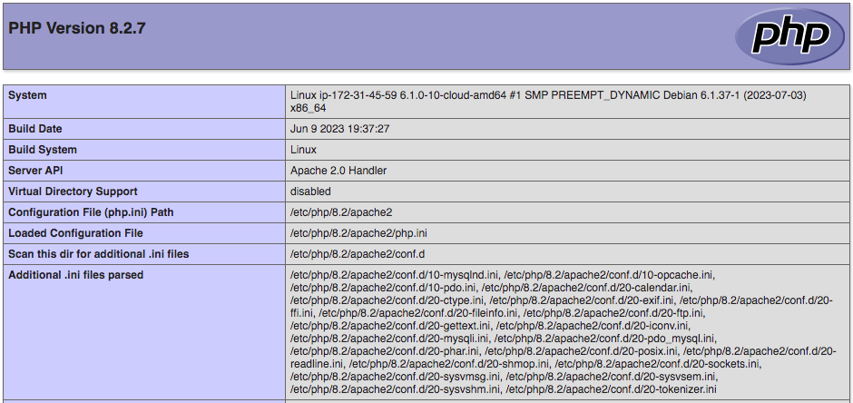
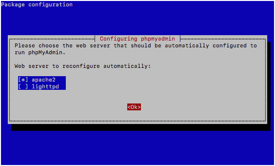

# Practica 2.5 - Instalación de la pila LAMP

## Introducción

En la teoría hemos visto que el servidor web raramente funciona solo. Cada vez hay menos páginas web estáticas y más servicios y aplicaciones que no solo necesitan el servidor web, sino que necesitan una plataforma web que contiene, además, un gestor de base de datos y algún lenguaje de programación interpretado.

Hoy en día son muchos los servicios que necesitan una plataforma web corriendo en el servidor antes de poder instalarlos. Estamos hablando de entornos de aprendizaje virtual, como Moodle, o gestores de blogs y páginas web como Wordpress.

Vimos en la teoría que existen distintas plataformas web libres, como LAMP y propietarias, como WISA. En esta práctica instalaremos una plataforma web LAMP completa, formada por: 

* **Linux**: sistema operativo. En nuestro caso usaremos Debian.
* **Apache**: servidor web.
* **MySQL o MariaDB**: gestor de bases de datos. Nosotros instalaremos MariaDb.
* **PHP**: lenguaje interpretado PHP, aunque a veces se sustituye por Perl o Python.

## Prerrequisitos

Antes de empezar con la instalación de los distintos componentes de la plataforma web necesitaremos:

* Crea en AWS Academy un EC2 Debian con los requisitos por defecto. Llámale ***PracticaLAMP***
* Crea un Grupo de seguridad y llámale también ***PracticaLAMP***. De momento abre los puertos para SSH, HTTP y HTTPS.

Conéctate por SSH al EC2 creado y actualiza el sistema.

```bash
sudo apt-get update && sudo apt-get upgrade
```

Ahora ya podemos empezar a instalar los elementos de la plataforma uno a uno.

## Instalación del servidor Apache.

Como todo servidor LAMP, lo principal es la A de Apache. Para instalar Apache únicamente debemos de ejecutar:

```bash
sudo apt install apache2
```

Comprobamos que se ha instalado correctamente y el servicio está en ejecución:

```bash
sudo systemctl status apache2
```

Si no estuviera arrancado recuerda que puedes usar `sudo systemctl enable apache2` para activarlo y que se arranque al inicio y `sudo systemctl start apache2` para arrancarlo.

Y listo, ya tenemos servidor web instalado. Ahora desde nuestro navegador favorito escribimos la IP pública de nuestro  servidor Debian (con http:// recuerda) y nos debería de salir el index de Apache por defecto.


## Instalación de MariaDB.

Ahora vamos a instalar un servidor de bases de datos para las aplicaciones que podamos instalar en nuestro servidor web, para ello instalaremos MariaDB que está basado en MySQL.

```bash
sudo apt install mariadb-server
```

Como antes, comprobamos que el servicio está en marcha. Como MariaDB está basado en Mysql mantiene el nombre de servicio `mysql`:

```bash
sudo systemctl status mysql
```

Una vez iniciado, no podremos iniciar sesión con MariaDB porque no hemos configurado aún el servidor para ello. Vamos a ejecutar este script que ayuda a securizar el servicio:

```bash
sudo mysql_secure_installation
```

Te hará varias preguntas. Importante contestar:

```bash
Change the root password? [Y/n] Y
```

Y ponle de password a root: `ieselcaminas`.

El resto de preguntas puedes mantener la base de datos en entorno de pruebas. Ten en cuenta que si fuera un entorno de producción las respuestas deberían ser distintas.

Y finalmente:

```bash 
Reload privilege tables now? [Y/n] y
 ... Success!

Cleaning up...

All done!  If you've completed all of the above steps, your MariaDB
installation should now be secure.

Thanks for using MariaDB!
```

Ya hemos configurado MariaDB, ahora podemos conectarnos mediante terminal:

```bash
# mysql -u root -p
Enter password: 
Welcome to the MariaDB monitor.  Commands end with ; or \g.
Your MariaDB connection id is 35
Server version: 10.11.4-MariaDB-1~deb12u1 Debian 12

Copyright (c) 2000, 2018, Oracle, MariaDB Corporation Ab and others.

Type 'help;' or '\h' for help. Type '\c' to clear the current input statement.

MariaDB [(none)]>
```
Puedes conocer los distintos comandos con `help` o `\h`. Para salir `\q`.

## Instalación de PHP

PHP es el componente de su configuración que procesará código para mostrar contenido dinámico. Puede ejecutar secuencias de comandos, establecer conexión con sus bases de datos de MariaDB para obtener información y entregar el contenido procesado a su servidor web para su visualización.

Una vez más, utiliza el sistema apt-get para instalar PHP. Además, incluye algunos paquetes de helper esta vez para que el código de PHP pueda ejecutarse con el servidor Apache y comunicarse con su base de datos de MariaDB:

```bash
sudo apt-get install php libapache2-mod-php php-mysql
```
Para que Apache aplique los cambios, es necesario reiniciar el servicio para que PHP esté activo.

```bash
sudo systemctl restart apache2
```

A fin de verificar que tu sistema esté configurado de forma adecuada para PHP, crearemos una secuencia de comandos PHP muy básica llamada `info.php`. Para que Apache encuentre este archivo y lo presente correctamente, debe guardarse en un directorio muy específico llamado web root. Este directorio se encuentra en /var/www/html/. Crea el archivo en esa ubicación ejecutando lo siguiente:

```bash
sudo nano /var/www/html/info.php
```

Con esto se abrirá un archivo vacío. Añade el siguiente texto, que es el código PHP válido, dentro del archivo `/var/www/html/info.php`

```php
<?php
phpinfo();
?>
```

Cuando termines, guarda y cierra el archivo.

Ahora puedes probar si tu servidor web puede mostrar correctamente el contenido generado por esta secuencia de comandos PHP. Para probar esto, visita esta página en tu navegador web. Necesitarás de nuevo la dirección IP pública de tu servidor Debian.

`http://IPservidorDebian/info.php`

La página a la que llegues debería tener un aspecto similar a este:



Una vez probada puedes borrar ese fichero que has creado.

## Instalación de phpMyAdmin

En estos momentos ya tenemos la pila LAMP creada y operativa y ya podríamos instalar cualquier servicio sobre ella: Moodle, Wordpress, NextCloud...

Pero vamos a instalar una cosa más que, no siendo imprescindible, si que nos será muy útil para gestionar las bases de datos de forma gráfica: phpMyAdmin.

Para ello

```bash
sudo apt-get install phpmyadmin
```

La instalación es bastante automática, aunque nos hará algunas preguntas. 

* Primero nos preguntará por el servidor web que tenemos instalado. Lógicamente le diremos que `apache2`.

    

* Después nos preguntará si gestionamos la configuración de phpMyAdmin con "dbconfig-common". Le diremos que si.

* Y finalmente nos pedirá la contraseña de root de MySQL. Recuerda que le pusimos "ieselcaminas".

Ahora ya puedes acceder a la página de phpMyAdmin con

`http://IPservidorDebian/phpmyadmin`

Te pedirá el usuario y contraseña. Recuerda usuario:`root` y pass:`ieselcaminas`.


Y si todo va bien estarás dentro para poder gestionar las bases de datos de tu MariaDB.


Si con lo anterior no pudieras acceder a Phpmyadmin, añade este enlace simbólico:

```sh
sudo ln -s /usr/share/phpmyadmin/ /var/www/html/phpmyadmin
```

## Conclusión

Hemos instalado la plataforma web LAMP completa con las últimas versiones de cada uno de sus elementos.

Ahora ya podrás instalar cualquier aplicación o servicio que requiera dicha plataforma para funcionar.

Recuerda al finalizar la práctica parar el laboratorio AWS Academy para no seguir consumiendo recursos innecesariamente.

## Referencias

* [Instalación de servidor web LAMP en Debian 11](https://voidnull.es/instalacion-de-servidor-web-lamp-en-debian-11/)
* [Cómo instalar la pila Linux, Apache, MariaDB, PHP (LAMP) en Debian 9](https://www.digitalocean.com/community/tutorials/how-to-install-linux-apache-mariadb-php-lamp-stack-debian9-es)
* [phpMyAdmin - Debian 11 Stable](https://usuariodebian.blogspot.com/2022/01/phpmyadmin-debian-11-stable.html)
