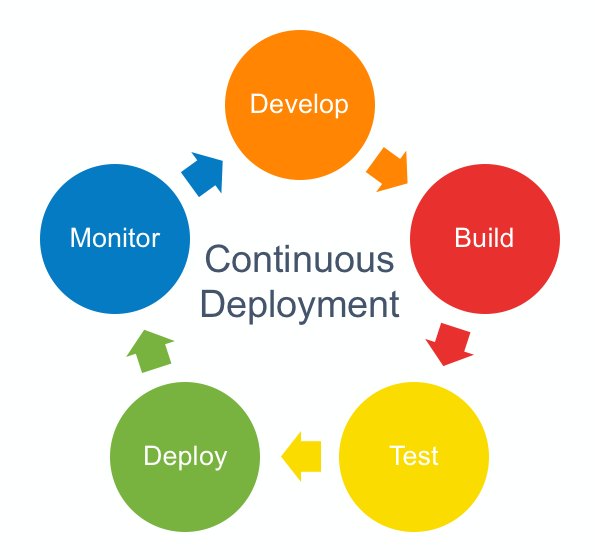
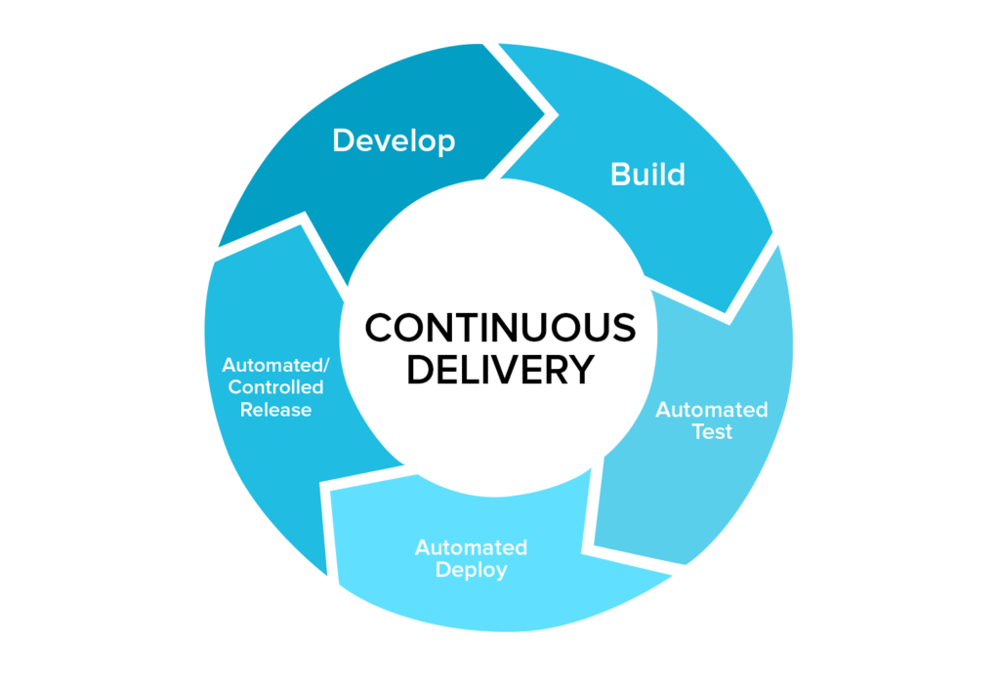

# **CI/CD (Continous Integration/Continous Deployment-Delivery)**

## Introducción

Aunque este apartado será objeto de un tema específico más adelante, no podemos dejar un tema dedicado al tema de despliegues de aplicaciones web sin mencionarlo.

La CI/CD es un método para distribuir las aplicaciones a los clientes con frecuencia mediante el uso de la automatización en las etapas del desarrollo de aplicaciones. Los principales conceptos que se le atribuyen son la integración, la distribución y la implementación continuas. Se trata de una solución para los problemas que puede generar la integración del código nuevo para los equipos de desarrollo y de operaciones (también conocida como "el infierno de la integración").

En concreto, el proceso de integración y distribución continuas incorpora la automatización y la supervisión permanentes en todo el ciclo de vida de las aplicaciones, desde las etapas de integración y prueba hasta las de distribución e implementación. Este conjunto de prácticas se conoce como "canales de CI/CD" y cuenta con el respaldo de los equipos de desarrollo y de operaciones que trabajan en conjunto de manera ágil, con un enfoque de DevOps o de ingeniería de confiabilidad del sitio (SRE).

### ¿Cuál es la diferencia entre la integración, la distribución y la implementación continuas?

Estas siglas tienen diferentes significados. "CI" siempre se refiere a la integración continua, que es un proceso de automatización para los desarrolladores. El éxito de la CI implica que se diseñen, prueben y combinen los cambios nuevos en el código de una aplicación con regularidad en un repositorio compartido. Supone una solución al problema de que se desarrollen demasiadas divisiones de una aplicación al mismo tiempo, que luego podrían entrar en conflicto entre sí.

La sigla "CD" se refiere a la distribución o la implementación continuas, y se trata de conceptos relacionados que suelen usarse indistintamente. Ambos se refieren a la automatización de las etapas posteriores del proceso, pero a veces se usan por separado para explicar hasta dónde llega la automatización.

Por lo general, la distribución continua se refiere a que los cambios que implementa un desarrollador en una aplicación se someten a pruebas automáticas de errores y se cargan en un repositorio (como GitHub o un registro de contenedores), para que luego el equipo de operaciones pueda implementarlos en un entorno de producción en vivo. Es una solución al problema de la falta de supervisión y comunicación entre los equipos comerciales y de desarrollo, así que su propósito es garantizar que la implementación del código nuevo se lleve a cabo con el mínimo esfuerzo.

La implementación continua (la otra definición de "CD") hace referencia al lanzamiento automático de los cambios que implementa el desarrollador desde el repositorio hasta la producción, para ponerlos a disposición de los clientes. Así ya no se sobrecarga a los equipos de operaciones con procesos manuales que retrasan la distribución de las aplicaciones. Con este tipo de implementación, se aprovechan los beneficios de la distribución continua y se automatiza la siguiente etapa del proceso.

La CI/CD puede incluir solamente la integración y la distribución continuas, o las tres prácticas vinculadas, con la implementación continua. Para complicar un poco más las cosas, a veces se utiliza el término "distribución continua" para abarcar también los procesos de la implementación continua.

En realidad, no vale la pena profundizar en la semántica. Solo debe recordar que la integración y la distribución continuas son un proceso que suele percibirse como una canalización e implica incorporar un alto nivel de automatización permanente y supervisión constante al desarrollo de las aplicaciones.

El significado de los términos varía en cada caso y depende de la cantidad de automatización que se haya incorporado a la canalización de integración y distribución continuas. Muchas empresas comienzan con la incorporación de la CI, y luego van automatizando la distribución y la implementación, por ejemplo, con las aplicaciones desarrolladas directamente en la nube.

### Integración continua - Continous Integration

El objetivo del diseño de las aplicaciones modernas es que los desarrolladores puedan trabajar de forma simultánea en distintas funciones de la misma aplicación. Sin embargo, si una empresa fusiona todo el código fuente diversificado en un solo día (conocido como el "día de la fusión"), las tareas pueden tornarse tediosas, manuales y muy lentas. Esto se debe a que si un desarrollador que trabaja de forma aislada implementa un cambio en una aplicación, existe la posibilidad de que entre en conflicto con las modificaciones que otros desarrolladores implementaron al mismo tiempo. El problema puede agravarse aún más si cada desarrollador personaliza su propio entorno de desarrollo integrado (IDE) local, en lugar de que todo el equipo adopte un IDE común, idealmente basado en la nube.

{: style="width:400px"}

La integración continua (CI) permite que los desarrolladores incorporen los cambios del código a un repositorio compartido con mayor frecuencia, o incluso a diario. Una vez que se incorporan las modificaciones del desarrollador, se validan con la compilación automática de la aplicación y la ejecución de distintas pruebas automatizadas (generalmente, de unidad e integración), para garantizar que los cambios no hayan introducido una falla. Esto significa que se debe probar todo, desde las clases y el funcionamiento hasta los distintos módulos que conforman toda la aplicación. Si una prueba automática detecta un conflicto entre el código nuevo y el actual, la CI facilita la resolución de esos errores con rapidez.

### Distribución continua - Continous Delivery

Después de la automatización de las compilaciones y las pruebas de unidad e integración de la CI, la distribución continua automatiza el traslado del código validado hacia un repositorio. Por eso, para que la distribución continua sea eficaz, es importante que la CI ya esté incorporada al proceso de desarrollo. El objetivo de la distribución continua es tener una base de código que pueda implementarse en el entorno de producción en cualquier momento.

{: style="width:400px"}

Cada etapa (desde la incorporación de los cambios al código hasta la distribución de las compilaciones listas para la producción) implica la automatización de las pruebas y del lanzamiento del código. Al final de este proceso, el equipo de operaciones puede implementar una aplicación para la producción de forma rápida y sencilla.

### Implementación continua - Continous deployment

La última etapa del canal consolidado de CI/CD es la implementación continua, que automatiza el lanzamiento de una aplicación a la producción, ya que es una extensión de la distribución continua, la cual automatiza el traslado de una compilación lista para la producción a un repositorio del código. Debido a que no hay ninguna entrada manual en la etapa anterior a la producción, la implementación continua depende en gran medida del correcto diseño de la automatización de las pruebas.

{: style="width:500px"}

En la práctica, los cambios que implementan los desarrolladores en la aplicación en la nube podrían ponerse en marcha unos cuantos minutos después de su creación (siempre que hayan pasado las pruebas automatizadas). Esto facilita mucho más la recepción e incorporación permanente de los comentarios de los usuarios. En conjunto, todas estas prácticas de CI/CD permiten que se implementen las aplicaciones con menos riesgos, ya que es más fácil incorporar los cambios en las aplicaciones poco a poco, en lugar de hacerlo todo de una sola vez. Sin embargo, también deben realizarse muchas inversiones iniciales, ya que se deben diseñar las pruebas automatizadas para que se adapten a las distintas etapas de prueba y lanzamiento en el canal de la CI/CD.

## Conclusión

Se ha explicado en este tema cuáles son las características, usos y diferencias entre los servidores web y los servidores de aplicaciones.

También hemos explicado detalladamente en qué consiste un proceso de despliegue clásico de una aplicación web, cuáles son sus fases y características. Para reforzar este proceso, hemos listado una serie de buenas prácticas a la hora de llevarlo a cabo.

Por último, hemos presentado las nuevas tendencias en el mundo del despliegue, como son las técnicas de CI/CD, que abordaremos de forma más profunda en el Tema 7.

## Referencias

[¿Qué son la integración y la distribución continuas (CI/CD)?](https://www.redhat.com/es/topics/devops/what-is-ci-cd)
