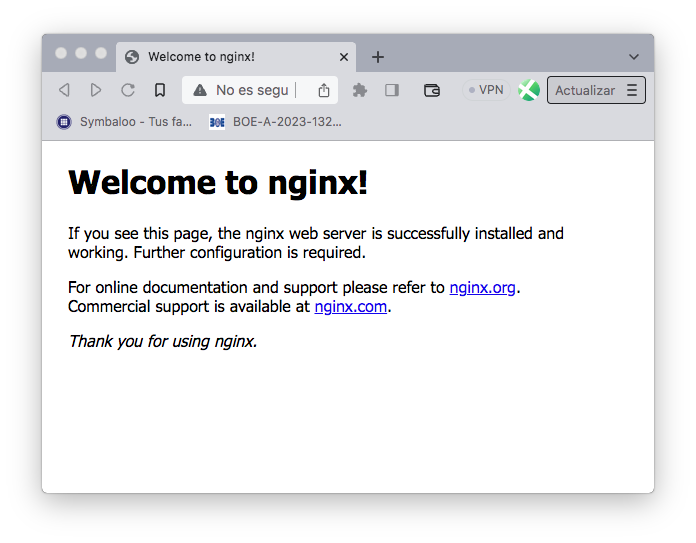

# Práctica 2.1 – Instalación y configuración de servidor web Nginx

## Instalación servidor web Nginx

Vamos a instalar el servidor Nginx en una VM Debian en AWS. Puedes usar la creada anteriormente o crear una nueva. Ya viste que el proceso es muy rápido.

Primero actualizamos los repositorios y actualizamos el sistema para después instalar el paquete correspondiente: 

```sh
sudo apt update && sudo apt upgrade

sudo apt install nginx
```

Comprobamos que nginx se ha instalado y que está funcionando correctamente: 

```sh
systemctl status nginx

```

!!!info Info
    **Esta práctica se ha hecho con Nginx 1.22.1-9**

## Comprobación de la instalación

Igual que ocurre en Apache, todos los archivos que formarán parte de un sitio web que servirá nginx se organizarán en carpetas. Estas carpetas, típicamente están dentro de `/var/www`.

Tras instalarlo podemos encontrar un ficher de muestra `/var/www/htm/index.nginx-debian.html` que nos permitirá comprobar que el sistema está funcionando correctamente. Vamos a intentar acceder al servidor web instalado usando la IP pública de la VM o bien la DNS de IPv4 pública. Puedes obtenerlas en la consola de `Instancias` de AWS.


Haz clic en cualquiera de los enlaces o copia y pega en la barra de direcciones de tu navegador web. ¿Consigues acceder al servidor? ¿Por qué crees que será? Reflexiona brevemente antes de seguir leyendo.

La respuesta es que el firewall de AWS está bloqueando los accesos. Si recuerdas, al configurar el "Grupo de seguridad" (firewall de AWS) le permitimos el acceso solo a SSH, pero no a HTTP ni a HTTPS. Vamos a hacerlo ahora. En la pestaña seguridad busca "Grupos de seguridad" y observa cómo sólo el puerto 22 (ssh) está abierto como entrada. Haz click sobre el grupo de seguridad para editarlo.


En "Reglas de entrada" vamos a "Editar reglas de entrada"


Agrega nueva regla.


Añade HTTP con origen "Anywhere-IPv4". Repite para HTTPS y "Guarda reglas"


Vuelve a intentar acceder al servidor haciendo clic sobre los enlaces en AWS. ¿Puedes acceder? Si no puedes, ¿por qué crees que será? Comprueba el protocolo con el que estás intentando acceder, ¿es http o https? Los enlaces en AWS intentan acceder al servidor usando https, pero no lo hemos activado todavía en nuestro servidor Nginx. Intenta acceder por http y si deberías acceder a la página de muestra.



Comprueba que realmente estás viendo la página `/var/www/htm/index.nginx-debian.html`. Editala para que muestre tu nombre en la bienvenida.


## Comprobar registros del servidor

Comprobad que las peticiones se están registrando correctamente en los archivos de logs, tanto las correctas como las erróneas: 

+ ```/var/log/nginx/access.log```: cada solicitud a su servidor web se registra en este archivo de registro, a menos que Nginx esté configurado para hacer algo diferente. 
  
+ ```/var/log/nginx/error.log```: cualquier error de Nginx se asentará en este registro.
 
!!!info 
    Si no os aparece nada en los logs, podría pasar que el navegador ha cacheado la página web y que, por tanto, ya no está obteniendo la página del navegador sino de la propia memoria.
    Para solucionar esto, podéis acceder con el *modo privado* del navegador y ya os debería registrar esa actividad en los logs.


