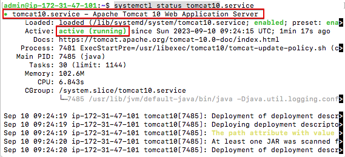
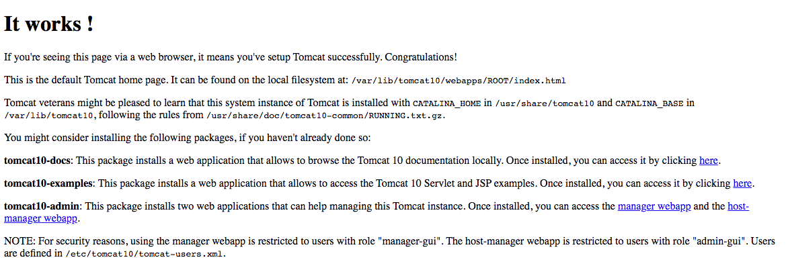
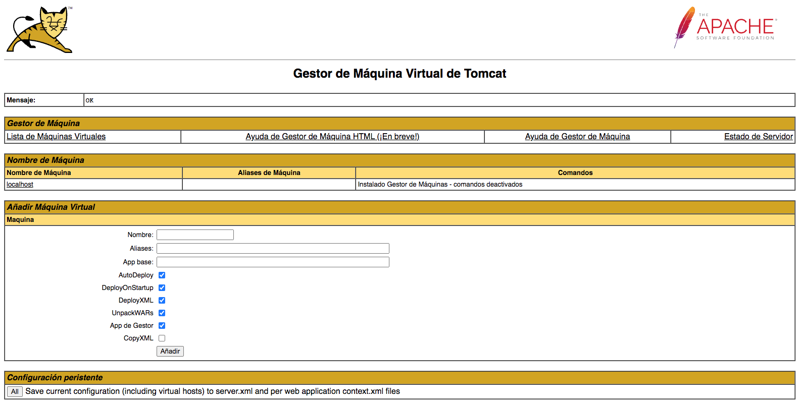

# Práctica 3.1: Instalación de Tomcat

## Introducción

En esta práctica vamos a instalar el servidor de aplicaciones Apache Tomcat en su última versión disponible.

Si consultamos el apartado de [versiones de Tomcat](https://tomcat.apache.org/whichversion.html){:target="_blank"} en su página oficial, nos daremos cuenta de que la última versión disponible en el momento de redacción de esta práctica es la 11.0.x que soporta versiones de Java 21 y posteriores. Esto podría hacer que algunos despliegues que realicemos con ficheros .war desarrollados en versiones anteriores de java planteen problemas. Esto nos servirá para ver la importancia de usar las mismas versiones en fase de desarrollo y fase de despliegue y acordar entre desarrolladores y encargados de despliegue cualquier actualización antes de llevarla a cabo.

En Java 9 se introdujeron novedades como un nuevo sistema de módulos (Jigsaw), [entre otras](https://blog.codmind.com/java-9-analisis-de-las-novedades/){:target="_blank"}.

En Java 11 se dio un paso más al haber renombrado completamente las rutas de paquetes javax.* a jakarta.*. Oracle, a pesar de haber hecho público el desarrollo de Java, no hizo lo mismo con su nombre. Por tanto, si el paquete a desplegar ya está compilado, poco podemos hacer. Pero si disponemos del código fuente y nos da un error de complilación, podemos mirar si los paquetes que está usando son los javax.* y sustituirlos por jakarta.* e intentar complilar de nuevo.

### Instalación de Tomcat

Esta práctica es muy sencilla y va a consistir en realizar la instalación del servidor de aplicaciones Tomcat, en una máquina virtual Debian.


#### Creación de la máquina virtual

Para empezar, entra en AWS Academy y crea un nuevo EC2 Debian con estas características. 

* Llámale P3Tomcat.
* Dale los recursos que te ofrece por defecto.
* El acceso al servidor Tomcat se realiza por el puerto TCP 8080. Puedes modificar el Grupo de seguridad ahora para permitir el acceso por http, https y TCP 8080 ahora o editarlo más tarde.

#### Instalación de Java

Una vez creada, entra como administrador y vamos a instalar Java en primer lugar.

1. Comprobar si está instalado:
    
    ```sh
    java --version
    ```
   
    En caso de no estarlo lo indicará

2. De no estar instalado lo haremos con:
   
    ```sh
    sudo apt-get update && sudo apt-get upgrade
    sudo apt-get install default-jdk
    sudo apt-get install default-jre
    ```

    Volver a comprobar: `java --version`

    Debería aparecer una pantalla como esta:

    


Una vez Java instalado pasamos a la instalación del servidor TOMCAT propiamente dicho.

#### Instalación de Apache Tomcat

Se puede hacer tanto con el administrador de paquetes `apt` como de forma manual. La <u>forma más recomendable</u> por su sencillez es la primera.

Ejecutamos

```sh
sudo apt-get install -y tomcat10 tomcat10-admin
```

Comprobamos si está instalado

```sh 
systemctl status tomcat10
```

Y comproblamos que está correctamente instalado.



Presionaremos la tecla q para volver al prompt.

Ahora comprueba que tienes acceso al servidor escribiendo en un navegador en tu equipo local `http://IP_SERVIDOR:8080` debe aparecer la siguiente pantalla. Fíjate que estamos accediendo por http (no https) y por el puerto 8080. Si no modificaste el Grupo de Seguridad en AWS para permitir el acceso a este puerto, hazlo ahora.



Para gestionar Tomcat de forma gráfica, tenemos un interfaz gráfico al que se accede mediante `http://IP_SERVIDOR:8080/manager`. Si intentas acceder verás que te pide un usuario y una contraseña y no podrás acceder. Hemos de crear un usuario de Tomcat con esos permisos.

Vamos a crearlo modificando el archivo `/etc/tomcat10/tomcat-users.xml` (con el
editor que quieras).

Merece la pena dedicarle un tiempo a leer ese fichero. Verás que Tomcat tiene una serie de roles administrativos predefinidos. Hemos de activar aquellos que queramos y luego asignarlos a los usuarios que deseemos. 

Para poder tener acceso al "Gestor de Aplicaciones Web de Tomcat" deberemos activar el rol "manager-gui". 

Y para acceder al "Gestor de Máquina Virtual de Tomcat" necesitaremos activar el rol "admin-gui".

Así pues, crearemos un usuario llamado "admin" con password "ieselcaminas" al que le asignaremos esos roles. 

Añade las siguientes líneas antes del cierre </tomcat users>.

```sh
  <role rolename="manager-gui"/>
  <role rolename="admin-gui"/>
  <user username="admin" password="ieselcaminas" roles="admin-gui,manager-gui"/>
```

Reinicia tomcat: `sudo systemctl restart tomcat10`

Comprueba el estado: `sudo systemctl status tomcat10`

Accede ahora a `http://IP_SERVIDOR:8080/manager`, introduce el usuario y contraseña creado y deberías acceder al "Gestor de Aplicaciones Web de Tomcat".


Accede ahora a `http://IP_SERVIDOR:8080/host-manager`, introduce el usuario y contraseña creado y deberías acceder al "Gestor de Aplicaciones Web de Tomcat".



### Despliegue manual mediante Gestor de Aplicaciones Web de Tomcat

Realizaremos el despliegue manual de una aplicación ya previamente empaquetada en formato WAR. Para ello accedemos al "Gestor de Aplicaciones Web de Tomcat" como vimos en la práctica anterior.

1. Nos logueamos con el usuario previamente creado.

2. Descargamos el archivo de muestra [sample.war](P3_2/sample.war){:target="_blank"}

3. Buscamos la sección que nos permite desplegar un WAR manualmente, seleccionamos nuestro archivo y lo desplegamos. 
    


Tras estos pasos, se nos listará la aplicación ya desplegada como un directorio más y podremos acceder a ella. 


Al lado de cada una de las aplicaciones instaladas aparecen varios comandos:

   * Replegar es para desinstalarla.
   * Reiniciar es muy útil si en algún momento no se están reflejando los cambios que estamos realizando, por ejemplo al cambiar el contenido de alguna clase.

3. Comprobamos el funcionamiento. Entrar en http://IP_SERVIDOR:8080/sample verás esto:


Si haces clic sobre "JSP page" verás esto.


Pero si haces clic sobre "servlet"


No se está ejecutando el Servlet y si ves los mensajes ha encontrado un problema. Recuerda que al principio hablamos de los problemas de versiones de java y que a partir de la versión 11 de Java se renombraron las librerías java a jakarka. Este .war se compliló en una versión anterior y ahora no podemos desplegarlo. Aquí el problema de las versiones.