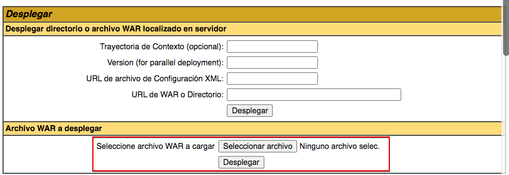
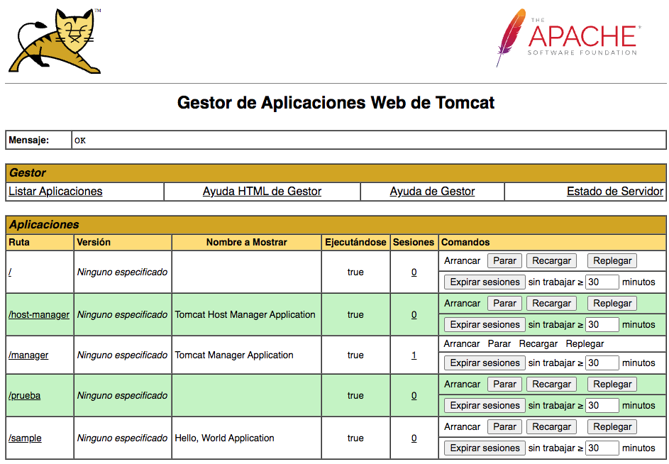

# Práctica 3.2: Despliegue de aplicaciones con Tomcat.

## Despliegue manual mediante Gestor de Aplicaciones Web de Tomcat

Realizaremos el despliegue manual de una aplicación ya previamente empaquetada en formato WAR. Para ello accedemos al "Gestor de Aplicaciones Web de Tomcat" como vimos en la práctica anterior.

1. Nos logueamos con el usuario previamente creado.

2. Descargamos el archivo de muestra [sample.war](P3_2/sample.war){:target="_blank"}

3. Buscamos la sección que nos permite desplegar un WAR manualmente, seleccionamos nuestro archivo y lo desplegamos. 
    
    

    Tras estos pasos, se nos listará la aplicación ya desplegada como un directorio más y podremos acceder a ella. 

    

    Al lado de cada una de las aplicaciones instaladas aparecen varios comandos:

      * Replegar es para desinstalarla.
      * Reiniciar es muy útil si en algún momento no se están reflejando los cambios que estamos realizando, por ejemplo al cambiar el contenido de alguna clase.

4. Comprobamos el funcionamiento. Entrar en `http://IP_SERVIDOR:8080/sample` verás esto:

    

    Si haces clic sobre "JSP page" verás esto.

    

    Pero si haces clic sobre "servlet"

    

    No se está ejecutando el Servlet y si ves los mensajes ha encontrado un problema. Recuerda que al principio hablamos de los problemas de versiones de java y que a partir de la versión 11 de Java se renombraron las librerías java a jakarka. Este .war se compliló en una versión anterior y ahora no podemos desplegarlo. Aquí el problema de las versiones.

## Crear una aplicación nueva paso a paso

En el apartado anterior hemos desplegado una aplicación de la que disponíamos del fichero .war. Ahora vamos a crear una aplicación nueva. Esto asemejaría un entorno en el que al departamento de despliegue le facilitan directamente el código fuente de la aplicación en lugar de la aplicación ya compilada.

Tomcat guarda las aplicaciones que despleguemos dentro de la carpeta `/var/lib/tomcat10/webapps`. Si hacemos un listado largo de dicha carpeta observaremos lo siguiente:

```sh
ls -la /var/lib/tomcat10/webapps
total 24
drwxrwxr-x 4 tomcat tomcat 4096 Sep 10 10:00 .
drwxr-xr-x 5 root   root   4096 Sep 10 15:24 ..
drwxr-xr-x 3 root   root   4096 Sep 10 09:24 ROOT
drwxr-x--- 5 tomcat tomcat 4096 Sep 10 10:00 sample
-rw-r----- 1 tomcat tomcat 4606 Sep 10 10:00 sample.war
```
Observa un par de cosas. 

   * Las aplicaciones desplegadas pertenecen al usuario `tomcat`.
   * La aplicación "sample" que desplegamos anteriormente tiene el fichero `sample.war` que subimos y una carpeta `sample` que corresponde a la aplicación ya desplegada

Recordamos pues que la estructura de un Archivo WAR es la siguiente:
- `/` `*.html` `*.jsp` `*.css` : Este directorio base contiene los elementos que comúnmente son utilizados en un sitio, Documentos en HTML , JSP's , CSS("Cascading Style Sheets") y otros elementos.
- `/WEB-INF/web.xml` : Contiene elementos de seguridad de la aplicación así como detalles sobre los Servlets que serán utilizados dentro de la misma.
- `/WEB-INF/classes/` : Contiene las clases Java adicionales a las del JDK que serán empleadas en los JSP's y Servlets
- `/WEB-INF/lib/` : Contiene los JAR's que serán utilizados por su aplicación.

  Y comprobamos que nuestra aplicación sample cumple con esa estructura:
```sh
ls -l /var/lib/tomcat10/webapps/sample
total 20
drwxr-x--- 2 tomcat tomcat 4096 Nov  5 18:07 META-INF
drwxr-x--- 4 tomcat tomcat 4096 Nov  5 18:07 WEB-INF
-rw-r----- 1 tomcat tomcat  376 Jul 30  2007 hello.jsp
drwxr-x--- 2 tomcat tomcat 4096 Nov  5 18:07 images
-rw-r----- 1 tomcat tomcat  636 Jul 30  2007 index.html

ls -l /var/lib/tomcat10/webapps/sample/WEB-INF/
total 12
drwxr-x--- 3 tomcat tomcat 4096 Nov  5 18:07 classes
drwxr-x--- 2 tomcat tomcat 4096 Nov  5 18:07 lib
-rw-r----- 1 tomcat tomcat  813 Jul 30  2007 web.xml
```

Por tanto, para desplegar nuevas aplicaciones manualmente deberemos :
1. Primero logearnos como usuario `tomcat` 
2. Segundo generar una estructura de carpetas para la aplicación a desplegar similar a la de "sample", que es la estructura que necesita Tomcat.

### 1. Usuario Tomcat

Para entrar como usuario `tomcat` veamos primero cómo está creado en el fichero `/etc/passwd`:

```sh
cat /etc/passwd
```

Y buscamos la línea:

`tomcat:x:994:994:Apache Tomcat:/var/lib/tomcat:/usr/sbin/nologin`

El último campo indica la ruta del shell asignado al usuario. Vemos que tiene `/usr/sbin/nologin` lo nos indica que es un usuario que no puede shell asignado y, por tanto, no puede logarse en el sistema. Como nosotros necesitamos logarnos cambiaremos el shell por:

`tomcat:x:994:994:Apache Tomcat:/var/lib/tomcat:/bin/bash`

Como desconocemos la password del usuario `tomcat` le asignaremos una nueva. Vamos a ponerle password `ieselcaminas`.

```sh
sudo passwd tomcat
```

Ahora entraremos en el sistema como usuario `tomcat`

```sh
su tomcat
```

### 2. Estructura de carpetas

Ahora ya podemos empezar a desplegar nuestra aplicación a la que llamaremos "prueba". Crearemos la siguiente estructura de carpetas dentro de `/var/lib/tomcat10/webapps`.


Podemos hacerlo en un solo comando con:
```sh
mkdir -p /var/lib/tomcat10/webapps/prueba/WEB-INF/classes
```

Si comprobamos en nuestro Gestor de Aplicaciones Web de Tomcat veremos que aparece nuestra nueva aplicación llamada "prueba" en la lista de aplicaciones. Aunque si intentamos hacer algo nos dará error al no contener nada todavía.



#### Creamos los archivos .java y .class

Dentro de la carpeta `prueba` crea el archivo `hola1.java` con el código siguiente:

```java
import javax.servlet.*;
import javax.servlet.http.*;
import java.io.*;
public class hola1 extends HttpServlet {
 public void init(ServletConfig conf)
    throws ServletException {
    super.init(conf);
 }

public void service(HttpServletRequest req, HttpServletResponse res)
 throws ServletException, IOException {
    res.setContentType("text/html");
    PrintWriter out = res.getWriter();
    out.println("<html>");
    out.println("<body>");
    out.println("<h1>servlet hola 1</h1>");
    out.println("</body>");
    out.println("</html>");
    }
}
```

Desde el directorio prueba ejecuta el comando para compilar la aplicación java: 

```sh
javac -classpath /usr/share/tomcat10/lib/servlet-api.jar hola1.java
``` 

¿Se ha podido complilar? Probablemente no, ¿verdad? Mira en los errores y recuerda lo que hemos hablado ya sobre las versiones de Java. ¿Se te ocurre dónde puede estar el error? 

!!!Atención
    Recuerda que comentamos que a partir de Java 11 las rutas de paquetes javax.* pasaron a jakarta.*. Prueba a cambiar las rutas en `hola1.java` y vuelve a complilar. ¿Se ha compilado bien ahora? Nuevamente, comprueba la importancia de usar las mismas versiones en desarrollo y despliegue.

Si no hay ningún problema el fichero `hola1.java` se compilará y aparecerá un fichero
`hola1.class`.

#### Configura el servlet
La principal diferencia de un servlet Java respecto a una aplicación Java normal, es que una aplicación (una vez compilada) ya la podríamos ejecutar, *mientras que el servlet lo tendremos que añadir al contenedor de servlets*.  Para ello mueve `hola1.class` a la carpeta `webapps/prueba/WEB-INF/classes`.

```sh
  mv hola1.class ./WEB-INF/classes
``` 

### Configura el servidor de aplicaciones
Ahora hay que configurar el servidor de aplicaciones (hay que decir dónde está el nuevo servlet). Para ello crea el fichero `web.xml` en el directorio **WEB-INF** (en él se indica donde está el servlet y como mapearlo en una llamada) con el siguiente código:

```xml
<?xml version="1.0" encoding="ISO-8859-1"?>
<!DOCTYPE web-app PUBLIC "-//Sun Microsystems, Inc.//DTD Web Application 2.3//EN" "http://java.sun.com/dtd/web-app_2_3.dtd">
<web-app>
    <display-name>Ejemplos tutorial</display-name>
    <description>Servlets de ejemplos del tutorial de Servlets y JDBC.</description>
    <servlet>
        <servlet-name>hola1</servlet-name>
        <servlet-class>hola1</servlet-class>
    </servlet>
    <servlet-mapping>
        <servlet-name>hola1</servlet-name>
        <url-pattern>/hola1</url-pattern>
    </servlet-mapping>
</web-app>
```
### Otros ficheros necesarios
Para el ejemplo vamos a necesitar 2 ficheros más dentro de la carpeta "prueba":

   * index.html
   * hola1.jsp

El fichero `index.html` contendrá lo siguiente:

```html
<html>
    <head>
        <title>Actividad de prueba con Tomcat</title>
    </head>
    <body bgcolor=white>
        <div style=" width:100% text-align:center">
            
            <br>
            <h1>Actividad con Tomcat</h1>
            <p>Despliegue de aplicaciones web</p>
        </div>
        <div style="background:#ffc; margin-top:30px; padding:30px; text-align:center">
            Ir a <a href="hola1.jsp">JSP page</a>
            <br>
            Ir al <a href="hola1">servlet</a>
        </div>
    </body>
</html>
```

Y el contenido de hola1.jsp:

```html
<html>
    <head>
        <title>Ejemplo página JSP</title>
    </head>
    <body bgcolor=white>
        <div style=" width:100%; text-align:center">
            
            <br>
            <h1>Ejemplo JSP hola1</h1>
            <br>
            <%= new String("Hola 1") %>
        </div>
    </body>
</html>
```

Observa cómo estamos usando una imagen `tomcat.gif`. Puedes copiarla del proyecto "sample"

Ya podemos probar nuestra aplicación de prueba desde el navegador de nuestro equipo accediendo a `http://IPSERVIDOR:8080/prueba/` o directamente desde el Gestor de Aplicaciones Web de Tomcat.

Probablemente hemos llegado hasta aquí copiando y pegando pero sin saber demasiado bien qué hemos hecho ni como hacer modificaciones.

#### El fichero index.html
Como en toda página web, el fichero `index.html` es el que se mostrará al acceder a la URL de la aplicación `http://IPSERVIDOR:8080/prueba/`. Comprueba su contenido y lo que se muestra en el navegador.

#### El fichero `hola1.jsp`

Un fichero JSP (JavaServer Pages) es un tipo de archivo utilizado en el desarrollo web que combina código Java con contenido HTML para crear páginas web dinámicas. Los archivos JSP permiten a los desarrolladores mezclar lógica de programación en Java con la presentación de páginas web de una manera más sencilla y organizada.

Una característica clave de los archivos JSP es la integración de Java: Los archivos JSP permiten la inclusión de fragmentos de código Java directamente en el contenido HTML utilizando etiquetas especiales <% %> para encerrar el código Java. Esto permite la ejecución de código en el servidor antes de que se envíe la página al navegador del cliente.

Observa como nuestro fichero hola1.jsp contiene la línea `<%= new String("Hola 1") %>` que es un fragmento de código java que ejecurará nuestro servidor Tomcat antes de entregar la página al usuario, sustituyéndolo por el resultado de ejecutar ese fragmento de código, que en este caso no es más que sacar una cadena de texto. Comprueba el resultado en el navegador.

### El servlet

El servlet es el primer fichero que hemos creado, llamado `hola1.java` y que después hemos compilado. Solo contiene un texto dentro de una etiqueta `<h1>`, su contenido se mostrará al hacer clic en `Ir al servlet` desde la página principal.

Observa cómo para mapear el servlet hemos tenido que hacerlo en el fichero `web.xml`.

!!!task
    Para ver si has entendido bien qué hace cada cosa realiza lo siguiente:

      * Cambia el texto que muestra el fragmento de código java en hola1.jsp
      * Crea un segundo servlet que llamaremos `hola2` y haz que en la página index.html tengas una línea adicional que diga `Ir a servlet2` que ejecute dicho servlet.

### Crea el Host Virtual - Voluntario

En la práctica 1 vimos cómo podíamos acceder al Tomcat Web Application Manager y al  Tomcat Virtual Host Manager.

Un host virtual en Tomcat nos permitirá acceder a una aplicación desplegada a través de un nombre de dominio de esa aplicación, sin necesidad de acceder al raíz del servidor tomcat y poner al final /app (sustituyendo app por el nombre de la aplicación). Es como los host virtuales que configuramos en Nginx en el tema anterior.

Llegados a este punto, ya tienes un par de aplicaciones desplegadas. Busca en internet cómo crear un web virtual y crea uno para una de ellas. Recuerda que tendrás que modificar el fichero /etc/hosts para acceder al host virtual creado.
