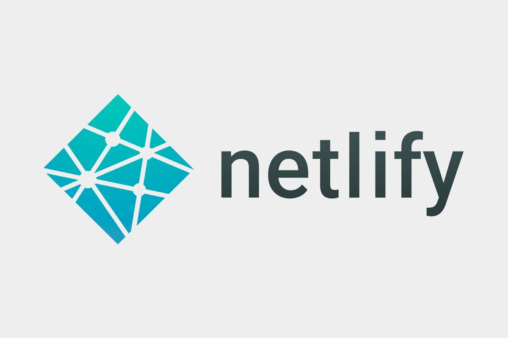
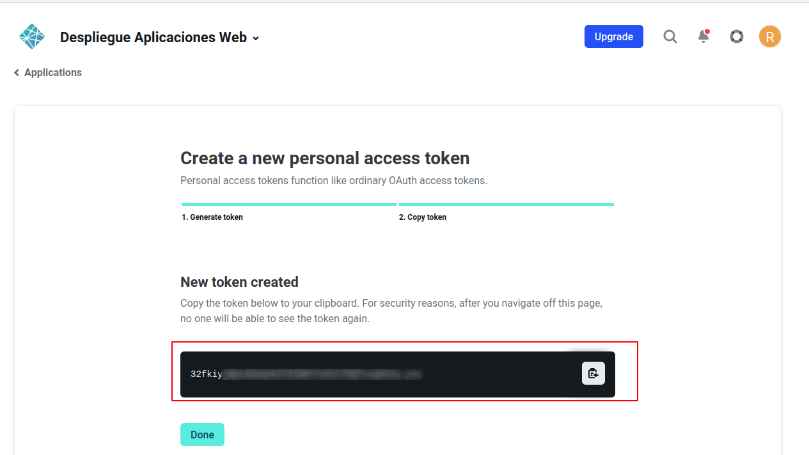
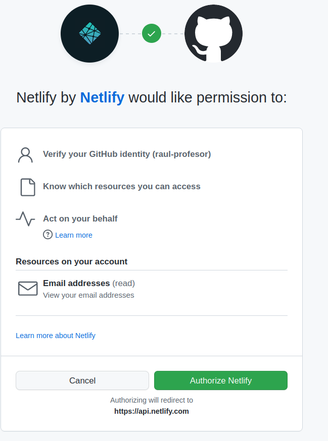
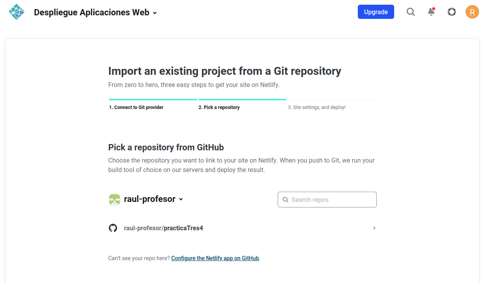
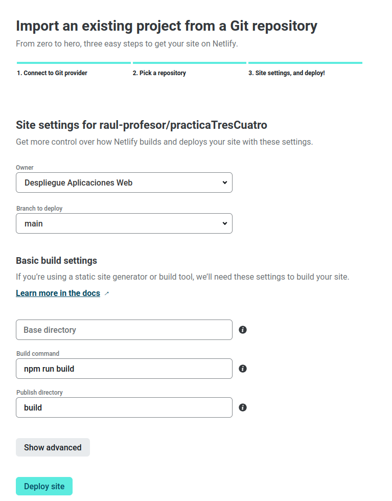
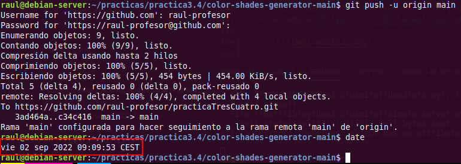
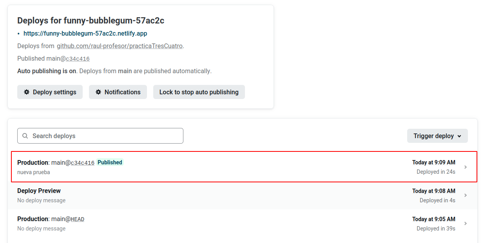

# Práctica 3.6: Despliegue de una aplicación en Netlify (PaaS)

!!!note "Nota"
    Para esta práctica vamos a crearnos cuentas en distintos servicios cuando se os pida:
    
    [GitHub](https://github.com/)
    
    [Netlify](https://www.netlify.com/)

## Introducción

En la práctica anterior hemos visto cómo desplegar una aplicación de Node.js sobre un servidor Express en local (en nuestro propio servidor Debian).

La práctica anterior podría asemejarse a las pruebas que realiza un desarrollador antes de pasar su aplicación al entorno de producción. 

Ya sabemos que entendemos el *despliegue o deployment* como el proceso de mover nuestro código típicamente de un sistema de control de versiones a una plataforma de hosting donde se aloja y es servida a los usuarios finales. 

A la hora de desplegar la aplicación en producción, podría utilizarse el método de copiar los archivos al servidor concreto vía el vetusto FTP, SSH u otros y desplegarla para dejarla funcionando. No obstante, esta práctica se acerca más a la realidad ya que utilizaremos un repositorio de Github y una plataforma de PaaS (Platform as a Service) como Netlify para desplegar adecuadamente nuestra aplicación en producción.

### ¿Qué es Github?

A pesar de que trataremos un poco más en profundidad Github en un tema posterior, daremos una breve explicación aquí.

GitHub es un servicio basado en la nube que aloja un sistema de control de versiones (VCS) llamado Git. Éste permite a los desarrolladores colaborar y realizar cambios en proyectos compartidos, a la vez que mantienen un seguimiento detallado de su progreso.


El control de versiones es un sistema que ayuda a rastrear y gestionar los cambios realizados en un archivo o conjunto de archivos. Utilizado principalmente por ingenieros de software para hacer un seguimiento de las modificaciones realizadas en el código fuente, el sistema de control de versiones les permite analizar todos los cambios y revertirlos sin repercusiones si se comete un error.

### ¿Qué es Netlify?

Netlify es un proveedor de alojamiento en la nube que proporciona servicios de backend sin servidor (*serverless*) para sitios web estáticos. Está diseñado para maximizar la productividad en el sentido de que permite a los desarrolladores (especialmente orientados al frontend), y a los ingenieros construir, probar y desplegar rápidamente sitios web/aplicaciones.

Funciona conectándose a un repositorio de GitHub, de donde extrae el código fuente. A continuación, ejecutará un proceso de construcción para pre-renderizar las páginas de nuestro sitio web/aplicación en archivos estáticos.

{: style="height:350px;width:600px"}


Hay numerosas razones a favor de usar Netlify, aquí están algunas de ellas:

  + Netlify hace que sea increíblemente sencillo desplegar un sitio web - de hecho, la forma más sencilla de lograrlo es utilizar GitHub, GitLab o Bitbucket para configurar el despliegue continuo.
  
  + Netlify hace que sea súper fácil lanzar un sitio web con su solución de gestión de DNS incorporada.
   
  + Podríamos desplegar fácilmente sólo una rama específica de nuestro proyecto Git - esto es útil para probar nuevas características que pueden o no llegar a la rama maestra/principal, o para determinar rápidamente cómo un PR (Pull Request) afectará a su sitio.

  + Netlify te permite previsualizar cualquier despliegue que hagas o quieras hacer - esto te permite a ti y a tu equipo ver cómo se verán los cambios en producción sin tener que desplegarlos en tu sitio existente.

  + Netlify proporciona una práctica función de envío de formularios que nos permite recoger información de los usuarios.

!!!note
    Tanto **Github** como **Netlify** pueden ser controlados desde el terminal de nuestro Linux, por lo que seguiremos el procedimiento de contectarnos vía SSH a nuestro Debian y realizar las operaciones por terminal.

## Aplicación para Netlify

Puesto que el interés en este módulo radica en el proceso de despliegue, suponiendo que la parte de desarrollo ya es abordada en otros módulos, vamos a utilizar una aplicación de ejemplo que nos ahorre tiempo para centrarnos en el despliegue.

Crearemos una EC2 Debian básica en AWS Academy. Nos conectaremos a ella por SSH, actualizaremos los repositorios e instalaremos GIT. También instalaremos Node.js como hicimos en la práctica P3.4.

Nos clonaremos [este](https://github.com/StackAbuse/color-shades-generator) repositorio:

`git clone https://github.com/StackAbuse/color-shades-generator`


## Proceso de despliegue en Netlify

Por mera curiosidad y ambición de aprendizaje, vamos a ver dos métodos de despliegue en Netlify:

+ Despliegue manual desde el CLI de Netlify, es decir, desde el terminal, a partir de un directorio local de nuestra máquina.
+ Despliegue desde un código publicado en uno de nuestros repositorios de Github

El primero nos permitirá conocer el CLI de Netlify y el segundo nos acercara más a una experiencia real de despliegue.

!!!task
    Vuestra primera tarea será [registraros en Netlify](https://www.netlify.com/) con vuestro email (no con vuestra cuenta de Github) y decirle que no cuando os pida enlazar con vuestra cuenta de Github (lo haremos más adelante).

### Despliegue mediante CLI

Una vez registrados, debemos instalar el CLI de Netlify para ejecutar sus comandos desde el terminal:

```sh
sudo npm install netlify-cli -g
```

Está claro que para realizar acciones de deploy, Netlify nos solicitará una autenticación, esto se hace mediante el comando:

```sh
netlify login
```

El cual nos muestra una pantalla del navegador para que concedamos la autorización pertinente. Sin embargo, recordemos el problema de que estamos conectados por SSH a nuestro servidor y no tenemos la posibilidad del uso de un entorno gráfico. Una forma de solucionarlo la tenemos en la "Práctica Voluntaria 3.1 - Despliegue de una aplicación Node.js en Heroku (PaaS)", pero Netlify nos ofrece otra forma.

En este caso, siguiendo las instrucciones de [la documentación](https://docs.netlify.com/cli/get-started/#obtain-a-token-in-the-netlify-ui):

+ Nos logeamos en Netlify

+ Generamos el token de acceso

    

    


+ Lo establecemos como variable de ambiente:

    

	Y nos logueamos
	```
	netlify login
	```

Bueno, tenemos el código de nuestra aplicación, tenemos nuestra cuenta en Netlify y tenemos el CLI necesario para ejecutar comandos desde el terminal en esa cuenta... ¿Podemos proceder al despliegue sin mayores complicaciones?

La respuesta es **NO**, como buenos desarrolladores y en base a experiencias anteriores, ya sabéis que hay que hacer un *build* de la aplicación para, posteriormente, desplegarla. Vamos a ello.

En primer lugar, como sabemos, debemos instalar todas las dependencias que vienen indicadas en el archivo `package.json`:

```sh
npm install
```
Y cuando ya las tengamos instaladas podemos proceder a realizar el build:

```sh
npm run build
```

Esto nos creará una nueva carpeta llamada `build` que contendrá la aplicación que debemos desplegar. Y ya podemos hacer un pre-deploy de la aplicación de la que hemos hecho build antes:

```
netlify deploy
```
Nos hará algunas preguntas para el despliegue:

+ Indicamos que queremos crear y configurar un nuevo site
+ El Team lo dejamos por defecto
+ Le indicamos el nombre que queremos emplear para la web (`tunombre-practica3-6`) **sustituye `tunombre` por tu nombre de pila**, y el directorio a utilizar para el deploy (directorio `./build`).

Y si nos indica que todo ha ido bien e incluso podemos ver el "borrador" (Website Draft URL) de la web que nos aporta. Copia esa URL, pégala en el navegador de tu ordenador local y comprueba que la aplicación se ha desplegado correctamente.

Podemos pasarla a producción finalmente tal y como nos indica la misma salida del comando:

```
If everything looks good on your draft URL, deploy it to your main site URL with the --prod flag.
netlify deploy --prod
```
Haz la prueba. Cuando te pida el "Publish directory" puedes ponerle `./build` nuevamente. 

Ya puedes acceder a tu aplicación en `https://tunombre-practica3-6.netlify.app/`.

!!!warning 
    Ve a la página web de Netlify y busca tu aplicación. Comprueba las opciones que tienes.


### Despliegue mediante conexión con Github

En primer lugar, vamos a eliminar el site que hemos desplegado antes en Netlify para evitarnos cualquier problema y/o conflicto:


En segundo lugar, vamos a borrar el directorio donde se halla el repositorio clonado en el paso anterior para así poder empezar de 0:

```
rm -rf directorio_repositorio
```

Como queremos simular que hemos picado el código a man o en local y lo vamos a subir a Github por primera vez, nos descargaremos los fuentes en formato `.zip` sin que tenga ninguna referencia a Github:

```sh
wget https://github.com/StackAbuse/color-shades-generator/archive/refs/heads/main.zip
```
Creamos una carpeta nueva y descomprimimos dentro el zip:

```sh
mkdir practica3_6

unzip main.zip -d practica3_6/
```

Entramos en la carpeta donde está el código:

```
cd practica3_6/color-shades-generator-main/
```
Ahora debemos crear un repositorio <u>**completamente vacío**</u> en Github que se llame `practicaTresSeis`:


Y tras ello, volviendo al terminal a la carpeta donde estábamos, la iniciamos como repositorio, añadimos todo el contenido de la misma para el commit, hacemos el commit con el mensaje correspondiente y creamos la rama main:


```sh
$ git init
$ git add .
$ git commit -m "Subiendo el código..."
$ git branch -M main
```

Y ahora sólo queda referenciar nuestra carpeta al repositorio recién creado en Github y hacer un `push` para subir todo el contenido del commit a él:

```
$ git remote add origin https://github.com/username/practicaTresSeis.git
$ git push -u origin main
```
Te pedirá un usuario y contraseña. El usuario es el tuyo de GitHub, pero la contraseña no. Deberás crear un "token personal". Para ello:

* Ve a GitHub, selecciona tu foto arriba a la derecha y luego "Settings"
* Busca "<> Developer settings"
* Ahora "Personal access tokens" - "Tokens (classic)
* Selecciona la casilla "repo"
* Y finaliza con "Generat token"
* Copia el token generado y esa será la password que tendrás que poner.

Ahora que ya tenemos subido el código a GitHub, de alguna manera debemos *enganchar* o enlazar nuestra cuenta de Github con la de Netlify para que éste último pueda traerse el código de allí, hacer el build y desplegarlo. Así pues, entramos en nuestro dashboard de Netlify y le damos a importar proyecto existente de `git`:


Le indicamos que concretamente de Github:


Y nos saltará una ventana pidiendo que autoricemos a Netlify a acceder a nuestros repositorios de Github:



Y luego le indicaremos que no acceda a todos nuestros repositorios sino sólo al repositorio que necesitamos, que es donde tenemos el código de nuestra aplicación:


Y ya quedará todo listo:



Y desplegamos la aplicación:



Netlify se encargará de hacer el `build` de forma automática tal y como hemos visto en la imagen de arriba, con el comando `npm run build`, publicando el contenido del directorio `build`.

!!!warning "Atención"
    Tras el deploy, en "Site settings" podeís y debéis cambiar el nombre de la aplicación por nombre-practica3-4, donde *nombre* es vuestro nombre.

Lo que hemos conseguido de esta forma es que, cualquier cambio que hagamos en el proyecto y del que hagamos `commit` y `push` en Github, automáticamente genere un nuevo despliegue en Netlify. Es el principio de lo que más adelante veremos como *despliegue continuo*.

<u>Comprobemos que realmente es así:</u>

  + Dentro de la carpeta `public` encontramos el archivo `robots.txt`, cuyo cometido es indicar a los rastreadores de los buscadores a qué URLs del sitio pueden acceder. A este archivo se puede acceder a través de la URL del site:

    

  + Dentro de la carpeta `public`, utilizando el editor de texto que prefiráis en vuestro terminal, modificad el archivo `robots.txt` para que excluya un directorio que se llame `nombre_apellido`, utilizando obviamente vuestro nombre y apellido.

    ```
    User-agent: *
    Disallow: /nombre_y_apellido/
    ```
  
  + Haz un nuevo `commit` y `push` (del caso anterior, recuerda el commando `git` previo para añadir los archivos a hacer commit)
  + Comprueba en el dashboard de Netlify que se ha producido un nuevo deploy de la aplicación hace escasos segundos

    

    
          
  + Accede a `https://url_de_la_aplicacion/robots.txt` y comprueba que, efectivamente, se ve reflejado el cambio

    

## Referencias

[¿Qué es Github?](https://www.hostinger.es/tutoriales/que-es-github)

[Deploying Node.js applications](https://www.geeksforgeeks.org/deploying-node-js-applications/)

[Guide to Deploying a React App to Netlify](https://stackabuse.com/guide-to-deploying-a-react-app-to-netlify/)

