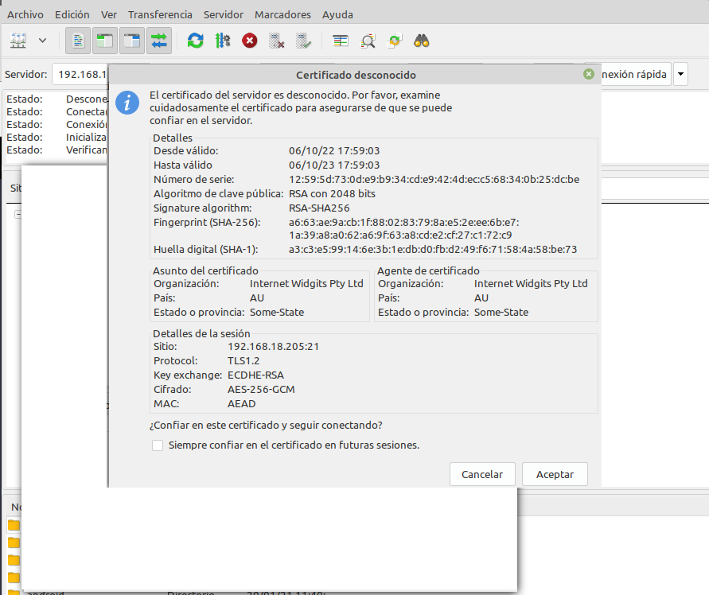

# Configurar servidor SFTP en Debian


Para ello utilizaremos una de las instancias creadas en AWS donde tengamos el Linux Server Debian (por ejemplo [P1.1. Linux Server en AWSAcademy](https://jmunozji.github.io/DAW/Unidad%201/P1_1/)). 

## Instalación del servidor VSFTPD

En primer lugar, actualizaremos los repositorios de Ububtu e instalaremos el **servidor vsftpd** :

```sh
sudo apt-get update
sudo apt-get install vsftpd
```
Ahora vamos a crear una carpeta en nuestro *home* en Debian que llamaremos ftp:

```sh
mkdir /home/nombre_usuario/ftp
```

En la configuración de *vsftpd* indicaremos que este será el directorio al cual vsftpd se cambia después de conectarse el usuario.

## Certificados de Seguridad con OpenSSL

Ahora vamos a crear los certificados de seguridad necesarios para aportar la capa de cifrado a nuestra conexión (algo parecido a HTTPS)  y para ello utilizaremos OpenSSL

```sh
sudo openssl req -x509 -nodes -days 365 -newkey rsa:2048 -keyout /etc/ssl/private/vsftpd.pem -out /etc/ssl/private/vsftpd.pem
```

## Configuración del servidor VSFTPD

Y una vez realizados estos pasos, procedemos a realizar la configuración de *vsftpd* propiamente dicha. Se trata, con el editor de texto que más os guste, de editar el archivo de configuración de este servicio, por ejemplo con *nano* o *vim*:

```sh
sudo nano /etc/vsftpd.conf
```

1. En primer lugar, buscaremos las siguientes líneas del archivo y las **eliminaremos por completo**:

```linuxconfig
rsa_cert_file=/etc/ssl/certs/ssl-cert-snakeoil.pem
rsa_private_key_file=/etc/ssl/private/ssl-cert-snakeoil.key
ssl_enable=NO
```

2. Tras ello, **añadiremos** estas líneas en su lugar;

```linuxconfig 
rsa_cert_file=/etc/ssl/private/vsftpd.pem
rsa_private_key_file=/etc/ssl/private/vsftpd.pem
ssl_enable=YES
allow_anon_ssl=NO
force_local_data_ssl=YES
force_local_logins_ssl=YES
ssl_tlsv1=YES
ssl_sslv2=NO
ssl_sslv3=NO
require_ssl_reuse=NO
ssl_ciphers=HIGH

local_root=/home/nombre_usuario/ftp
```

3. Y, tras guardar los cambios, **reiniciamos el servicio** para que coja la nueva configuración:

```sh
sudo systemctl restart --now vsftpd
```
 
## Comprobación de que servidor SFTP funciona correctamente

!!!task "Tarea"
    Configura un nuevo dominio (nombre web) para el .zip con el nuevo sitio web que os proporcionado. 
    **En este caso debéis transferir los archivos a vuestra Debian mediante SFTP.**

Tras acabar esta configuración, ya podremos acceder a nuestro servidor mediante un **cliente FTP** adecuado, como por ejemplo [Filezilla](https://filezilla-project.org/) con entorno gráfico o por comando con ftp, de dos formas, a saber:

+ Mediante el puerto por defecto del protocolo <u>inseguro</u> FTP, el **21**, pero utilizando certificados que cifran el intercambio de datos convirtiéndolo así en <u>seguro</u>
  
+ Haciendo uso del protocolo *SFTP*, dedicado al intercambio de datos mediante una conexión similar a SSH, utilizando de hecho el puerto **22**.

La que vamos a intentar es realizar una transferencia de archivos entre nuestro servidor FTP en Debian (instancia AWS) y el cliente FTP (nuestro ordenador). 

Para ello necesitamos un servidor FTP que ya tenemos instalado y configurado en Dedian y debemos disponer de un cliente en nuestro ordenador local, podermos utilziar estas dos opciones (en modo comando o en modo gráfico), veamos pues;
    
### 1. Cliente FTP de consola tendremos el comando ftp


## 2. Cliente FTP en nuestro ordenador local

Tras descargar <U>**el cliente FTP**</u> en nuestro ordenador, introducimos los datos necesarios para conectarnos a nuestro servidor FTP en Debian:


+ La IP de Debian (recuadro rojo)
+ El nombre de usuario de Debian (recuadro verde)
+ La contraseña de ese usuario (recuadro fucsia)
+ El puerto de conexión, que será el 21 para conectarnos utilizando los certificados generados previamente (recuadro marrón)

Tras darle al botón de *Conexión rápida*, nos saltará un aviso a propósito del certificado, le damos a aceptar puesto que no entraña peligro ya que lo hemos genrado nosotros mismos:



Nos conectaremos directamente a la carpeta que le habíamos indicado en el archivo de configuración `/home/raul/ftp`

Una vez conectados, buscamos la carpeta de nuestro ordenador donde hemos descargado el *.zip* (en la parte izquierda de la pantalla) y en la parte derecha de la pantalla, buscamos la carpeta donde queremos subirla. Con un doble click o utilizando *botón derecho > subir*, la subimos al servidor.


Si lo que quisiéramos es conectarnos por **SFTP**, exactamente igual de válido, haríamos:


Fijáos que al utilizar las claves de SSH que ya estamos utilizando desde la Práctica 1, no se debe introducir la contraseña, únicamente el nombre de usuario.

Puesto que nos estamos conectando usando las claves FTP, nos sale el mismo aviso que nos salía al conectarnos por primera vez por SSH a nuestra Debian, que aceptamos porque sabemos que no entraña ningún peligro en este caso:


Y vemos que al ser una especie de conexión SSH, nos conecta al `home` del usuario, en lugar de a la carpeta `ftp`. A partir de aquí ya procederíamos igual que en el otro caso.

Recordemos que debemos tener nuestro sitio web en la carpeta `/var/www` y darle los permisos adecuados, de forma similiar a cómo hemos hecho con el otro sitio web. 

El comando que nos permite descomprimir un *.zip* en un directorio concreto es:

```sh
unzip archivo.zip -d /nombre/directorio
```

Si no tuvieráis unzip instalado, lo instaláis:

```sh
sudo apt-get update && sudo apt-get install unzip
