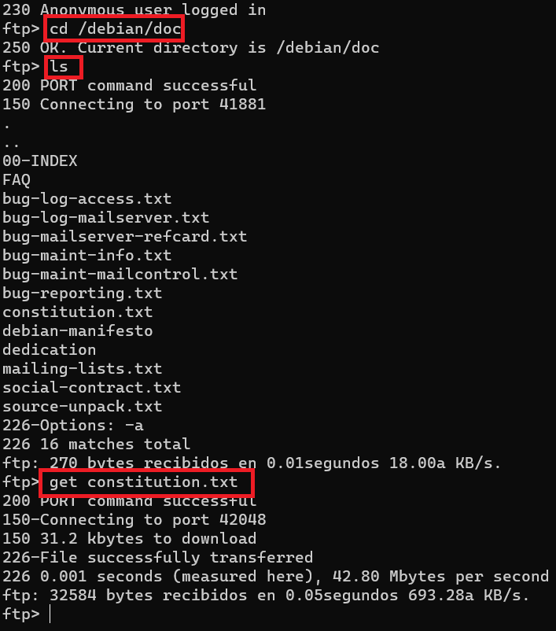
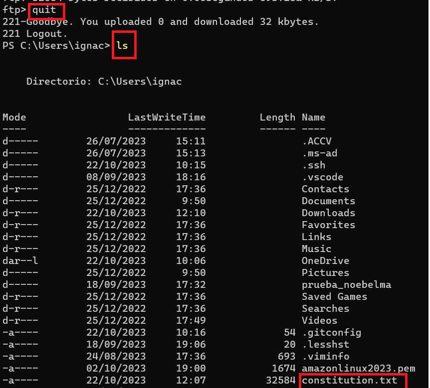
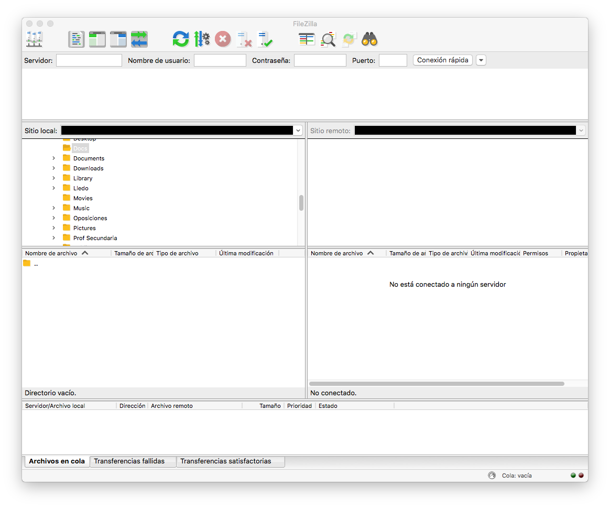
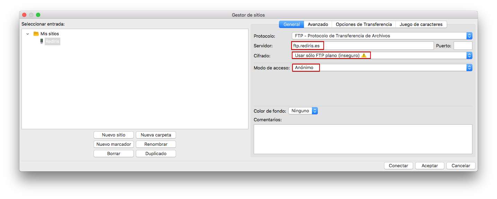
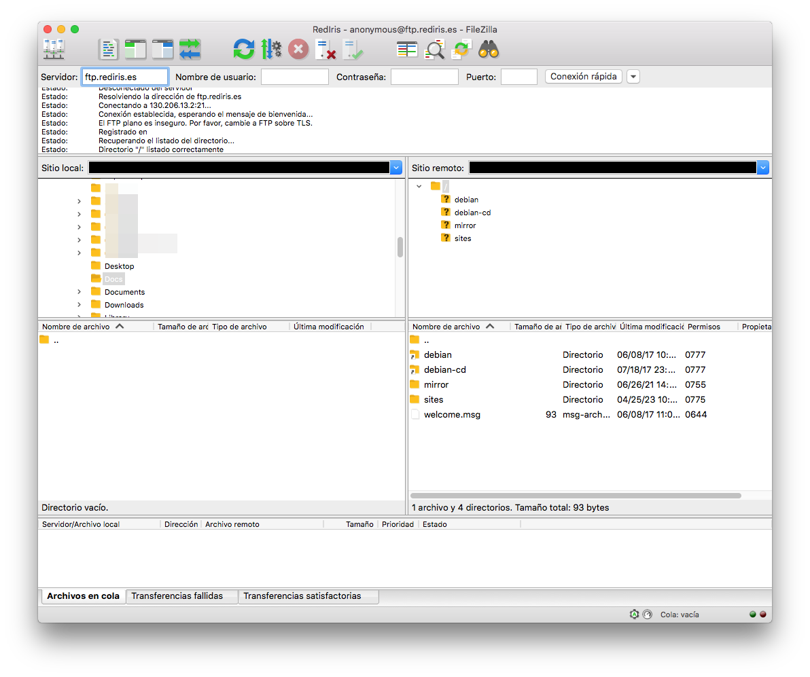

# Práctica 4.1 - Acceso a un servidor FTP público ftp.rediris.es

## Objetivo. 

Conectarse a un servidor público utilizando los comandos básicos de ftp y descargar un archivo.

## Acceso en modo comando.

Vamos a conectarnos a un servidor FTP público desde una ventana de comando de tu sistema operativo.

- Abre un terminal cmd en Linu
- PowerShell en Windows
- Terminal en Mac OS X

<!--
!!!note
    Si en Mac OSX no tienes FTP disponible puedes instalarlo con `brew install lftp` y usar el comando `lftp`.
--->

Utiliza el comando ftp, esto hará que entres dentro del servidor ftp de tu ordenador y visualiza los comandos ftp disponibles en tu máquina con el comando help.

```sh
ftp
```

```sh
help
```


Vamos a conectar con una red pública como es ftp.rediris.es con el usuario anónimo, por lo que no hace falta registrarse con ningún usuario, pulsamos intro cuando nos pida el usuario. 

```sh
open ftp.rediris.es
```


Posteriormente vamos listar el contenido de archivo y directorios y accederemos a la carpeta /debian/doc para descargar el archivo constitution.txt, para ello sigue las indicaciones siguientes 

```
get constitution.txt
```


Para comprobar que se ha descargado correctamente, salimos del servidor ftp y listamos los archivos de nuestra máquina. Donde podemos observar que el archivo se ha descargado correctamente.
```
quit
```



!!!warning
    En definitiva los permisos del usuario anónimo en un servidor ftp se establecerán para que solamente pueda moverse por los directorios y descargar archivos, nunca subirlos, esto es, normalmente el usuario anónimo no podrá crear ni eliminar ficheros y directorios.


## Acceso desde cliente gráfico.

Vamos a ver ahora cómo acceder a un servidor FTP desde un cliente gráfico. Usaremos FileZilla por tratarse de un SW de código abierto y disponible para todos los sistemas operativos más utilizados.

Abre Filezilla y verás el entorno similar a este.



Ahora vamos a conectarnos a ftp.rediris.es. Prueba a hacer una conexión rápida poniendo el servidor y usuario "anonymous" e intenta conectarte. Observa los mensajes que obtienes. ¿Has podido conectarte? ¿Sabes por qué no puedes?

Si miras bien los mensajes verás que has llegado al servidor, has autenticado pero obtienes un error que dice `Error: Se ha recibido una alerta TLS del servidor: Handshake failed (40) `

El motivo es que el FTP plano, sin cifrado, no es la opción por defecto y la conexión rápida está intentando usar cifrado TSL.

Así que vamos a crear una conexión avanzada.


Ahora crea un "Nuevo sitio" sin cifrado como en la imagen.



Acepta los mensajes que te previenen de usar FTP sin cifrado. Comprueba en los mensajes que has podido conectarte al servidor.



En la parte izquierda de la pantalla tendrás un navegador que te permitirá moverte por la estructura de directorios de tu equipo local. En la derecha podrás moverte por el sitio remoto.

Selecciona ahora en la izquierda donde quieres descargarte el archivo y en la derecha busca `/debian/doc/constitution.txt` como hicimos por comando.

Haz doble clic sobre el archivo para descargarlo. También puedes hacer clic con el botón derecho y "Descargar".

Comprueba cómo se descarga tu archivo.

Para finalizar la conexión selecciona el icono de desconectar.


## Conclusión

En esta práctica has aprendido a conectarte a un servidor FTP y descargarte archivos tanto por comando como con un programa gráfico.

A partir de ahora configuraremos el servidor, pero necesitarás hacer pruebas desde el cliente para probar las distintas configuraciones.


