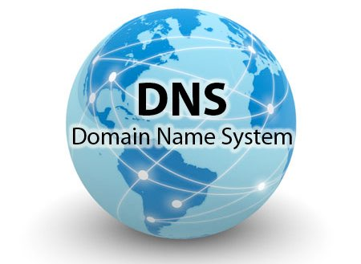
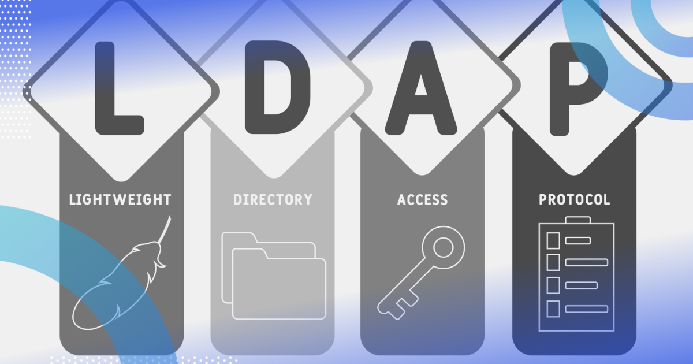

# 5.1 Servicios de red implicados en el despliegue de aplicaciones web

En esta unidad vamos a estudiar 2 servicios de red implicados en el despliegue de aplicaciones web: el servicio de nombres de dominio o DNS y el servicio de directorio LDAP.

Aunque estos 2 servicios no son imprescindibles para desplegar una aplicación web (de hecho, hasta ahora no los hemos usado), si que son muy importantes para hacerlo de una forma amigable para el usuario y ayudar a los administradores en la gestión de los accesos a los servicios.

El servicio DNS (Sistema de Nombres de Dominio) es una infraestructura que traduce nombres de dominio legibles por humanos en direcciones IP numéricas, permitiendo la localización y acceso a recursos en Internet de manera más sencilla, actuando como un directorio distribuido para la resolución de nombres.

Un servicio de directorio como LDAP (Protocolo Ligero de Acceso a Directorios) es una plataforma que organiza y almacena información de manera jerárquica, facilitando la gestión centralizada y el acceso eficiente a datos de usuarios, dispositivos y recursos en una red.

