# Servicio DNS (Domain Name System)

## Introducción

El sistema de nombres de dominio DNS (Domain Name System) proporciona un mecanismo eficaz para llevar a cabo la resolución de nombres de dominio a direcciones IP. Como usuarios (humanos) nos es más fácil dirigirnos a un nombre de dominio (de host, de web, de servidor de correo, etc.) utilizando un texto identificativo (por ejemplo, www.gva.es) que a la dirección IP pertinente (por ejemplo, 193.144.127.85). el servicio DNS no sólo permite hacer la resolución de nombres de dominio a direcciones IP, sino también la resolución inversa. Es decir, a partir de una IP averiguar el nombre de dominio. 

El servicio DNS proporciona independencia del nombre de dominio respecto a la IP. Así un dominio puede cambiar de IP de forma transparente para los usuarios del dominio. Incluso es usual que un dominio se identifique con más de una IP como medida de redundancia contra la caída del sistema o como balanceo de cargas. Otros servicios proporcionados por el DNS son la identificación de los servidores de correo de un dominio, de cada uno de los hosts que pertenecen a la red, servidores de impresión, etc.

## Sistemas de nombres planos y jerárquicos

El problema de la identificación de equipos se produce desde el principio de la existencia de las redes de ordenadores y no es algo específico de TCP/IP. Hacía falta un *lenguaje humano* para realizar esta identificación. 

En los albores de las redes, cuando ARPANET (la red predecesora de Internet), los nombres los equipos se centralizaban en un archivo llamado host.txt (/etc/hosts en Linux), que incluía el nombre del equipo y su IP. Esto es lo que se conoce como un ***sistema de nombres plano***. Puede ser adecuado para redes pequeñas pero no es escalable ni práctico en redes grandes y mucho menos en Internet. 

Ejemplo de fichero de nombres plano: 


### Elementos del sistema de nombres de dominio

El **espacio de nombres de dominio** está formado por los nombres válidos utilizados para identificar servicios o máquinas en una red. Se puede representar mediante una **estructura jerárquica de topología arbórea**, es decir, todos los nombres forman un árbol invertido donde cada nodo se separa de los otros nodos por un punto `.`. 

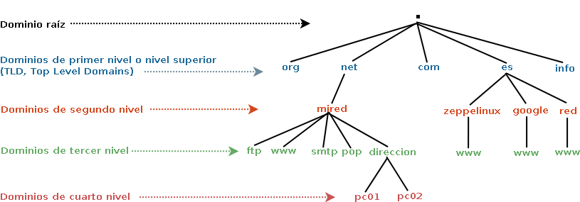

#### Nombres de dominio

Los nombres de dominio pueden estar formados por una o más cadenas de caracteres separadas por puntos y no se distingue entre mayúsculas y minúsculas. Por ejemplo, www.deaw.es. es lo mismo que WWW.deaw.ES.. 


Los nombres de dominio se expresan como secuencias de **etiquetas (labels)**.

#### Dominios raíz

En teoría, todos los dominios deben de terminar con un punto (.). Es así porque el **árbol de nombres de dominio (espacio de nombres de dominio)** empieza con el dominio `.` que se conoce como **dominio raíz (root)**. En realidad es un elemento nulo de 0 caracteres que se representa con un punto (.). 

Un dominio se lee de derecha a izquierda, empezando por el punto `.`, aunque en la práctica lo hacemos de izquierda a derecha. El punto inicial, generalmente se omite ya que los programas lo añaden por defecto y es meramente formal, pero en ocasiones, será necesario que indiquemos el nombre de dominio completo incluyendo el **dominio raíz**, es lo que se conoce como nombres de dominio completos (**Fully Qualified Domain Names, FQDN**). 

#### Dominios y subdominios

Como consecuencia de la organización jerárquica del espacio de nombres de dominios, podemos utilizar los términos dominio y subdominio. Por ejemplo, `deaw.es.` es un subdominio del dominio `es.` y `www.deaw.es`. es un subdominio del dominio `deaw.es.`. 

Los dominios o subdominios que cuelgan del dominio raíz `.` se conocen como dominios de primer nivel o dominios de nivel superior (Top Level Domains, TLD), los que cuelgan de los dominios TLD se denominan dominios de segundo nivel y así sucesivamente

### Zonas

Una zona es una porción del espacio del espacio de nombre de dominio en el DNS cuya responsabilidad administrativa recae sobre un único responsable. 

Los servidores que gestionan la zona tienen información completa sobre ella y se dice que son autorizados para esa zona. 

Las **zonas** se almacenan en **archivos de texto** o en **bases de datos**, según el tipo de software que se utilice para montar el **servidor DNS** y de como se configure. 

Tomemos como ejemplo el dominio deaw.es. y veamos parte de su archivo de zona 

```linuxconfig
...
deaw.es.		 IN	NS		ns1.deaw.es.
ns1.deaw.es.	 IN	A		192.168.1.20
natos.deaw.es. IN	A		192.168.1.21
waor.deaw.es.	 IN	A		192.168.1.22
www.deaw.es.	 IN	CNAME	natos.deaw.es.
ftp.deaw.es.	 IN	CNAME	waor.deaw.es.
...
```
<u>A cada una de las líneas del fichero se las conoce como registros de recurso (RR: Resource Records) y definen los tipos de datos en el Domain Name System (DNS)</u>. Se utilizan para almacenar datos sobre nombres de dominio y direcciones IP. Una base de datos o fichero de zona está formada por una serie de registros de recursos. Cada registro de recurso da información pertinente sobre un objeto determinado. Por ejemplo, los **registros de tipo (A)** asocian un nombre de host con una dirección IP, y los **registros de puntero de búsqueda inversa (PTR)** asocian una dirección IP con un nombre de host y un **registro (NS)** define un servidor DNS para la zona. El servidor DNS utiliza estos registros de recurso para resolver las consultas de los hosts de su zona. 

Cuando un **servidor DNS es autorizado** para una zona, es el responsable de los nombres de dominio para esa zona. En nuestro ejemplo, ns1.deaw.es es el servidor autorizado para la zona deaw.es. y en él se definen los nombres que cuelgan de deaw.es como por ejemplo, www.deaw.es, ftp.deaw.es, natos.deaw.es, etc. 

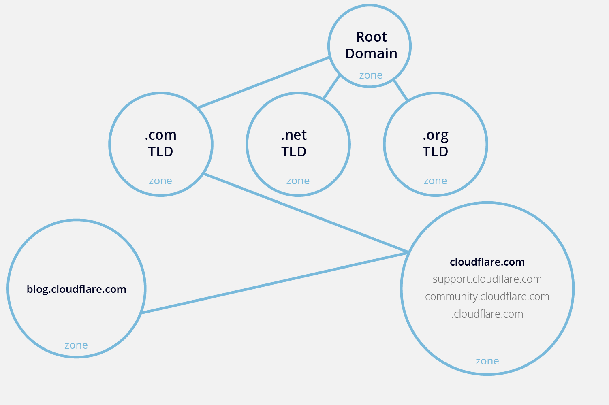{: style="height:450px;width:650px"}

La organización que administra el servidor DNS y por lo tanto la zona, puede delegar o no alguno de sus subdominios. Supongamos que de deaw.es. cuelgan los subdominios teoria.deaw.es. y practicas.deaw.es. y se decide delegar solo el subdominio practicas.deaw.es.. Esto implica que existirá otro servidor DNS autorizado para el dominio practicas.deaw.es., que almacenará el fichero de zona para dicho dominio.

<u>Una zona no es lo mismo que un dominio.</u> Un **dominio** es un **subarbol del espacio de nombres de dominio** y los datos asociados a los nombres de un **dominio** pueden estar almacenados en una o varias **zonas**, distribuidas en uno o varios **servidores DNS**. 

!!!info
    Básicamente una zona es una porción de un dominio.

Un **servidor DNS** puede ser autorizado sobre varias **zonas**, por ejemplo, el mismo **servidor DNS** puede ser autorizado para la zona deaw.es. y para la zona seguridadinformatica.es..

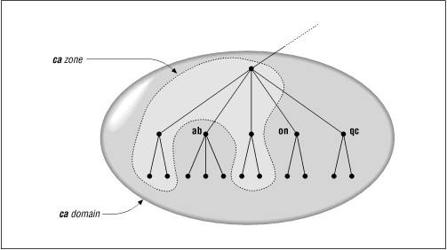

#### Tipos de RR (Resource Record)

En esta subsección vamos a ver cuáles son los registros de recursos o RR más utilizados. Antes debemos aclarar algunos conceptos:

##### $TTL (Time To Live)

El TTL o tiempo de vida determina, en segundos, durante cuánto tiempo son validos los RR. Pueden indicarse en semanas ($TTL 1W), días ($TTL 7D), horas ($TTL 168H) o minutos (10080M).

En otras palabras, el TTL indica cuánto tiempo tardarán en aplicarse los cambios que le hagamos a un RR desde que los hacemos. En el ejemplo del párrafo anterior, los servidores DNS comprobarán cada semana si se ha producido algún cambio en esos RR.
Debe declararse al inicio del archivo de zona.

##### $ORIGIN

La directiva $ORIGIN define el nombre del dominio que será añadido al final de cualquier nombre que no acabe en punto (nombres relativos o no cualificados) en los RR, para así transformarlos en nombres FQDN (fully qualified domain name). Si un nombre acaba en punto, se considera un nombre FQDN y no se utilizaría $ORIGIN.

Su sintaxis o forma de escribirlo será:

```linuxconfig
$ORIGIN nombre-dominio
```

Por ejemplo:

```linuxconfig
$ORIGIN deaw.es.
;A partir de aquí se añade deaw.es. a todos los nombres relativos
...
```
##### Formato general de los RR

El formato con el que se introducen los RR en los archivos de zona es del siguiente estilo:

```linuxconfig
Nombre de dominio		[TTL]		Clase		Tipo		Tipo-Dato
```
Así por ejemplo, un RR quedaría tal que así:

```linuxconfig
profesor.deaw.es	7200		IN		A		192.168.10.254
```

##### Tipos de registros

Aclarados los puntos anteriores, ahora sí vamos a ver los principales tipos de registros:

+ <u>**Registro SOA (Start Of Authority)**</u>: Especifica información autoritaria sobre una zona DNS, incluyendo el servidor de nombre primario, el email del administrador, el número de serial o versión de la zona, y varios temporizadores.

    Ejemplo:

    ```linuxconfig
        deaw.es.   IN   SOA   ns1.deaw.es.   super.deaw.es. (
                    20190425001	; serial
                    604800	; refresh (7 días)
                    86400	; retry (1 día)
                    2419200	; expire (28 días)
                    604800 )	; TTL negativo (7 días)
        ...
    ```

+ <u>**Registro NS (Name Server)**</u>:Cuando se delega la administración de subdominios en otros servidores, este registro indica cuáles son esos servidores autorizados.

    ```linuxconfig
    ...
    deaw.es.	IN	NS	ns1.deaw.es.	;Servidor DNS maestro
    deaw.es.	IN	NS	ns2.deaw.es.	;Servidor DNS esclavo
    deaw.es.	IN	NS	dns.deaw.net.	;Servidor DNS esclavo
    
    ns1.deaw.es.	IN	A	192.168.10.20
    ns2.deaw.es.	IN	A	192.168.10.21
    
    ;DELEGACIÓN
    practicas.deaw.es.	IN	NS	ns1.practicas.deaw.es.
    redes.deaw.es.	IN	NS	dns.deaw.net.
    
    ```

+ <u>**El registro A (Address)**</u>, también conocido como registro de dirección, establece una correspondencia entre un nombre de dominio completamente cualificado (FQDN) y una dirección IP versión 4.
  
    ```linuxconfig
    ...
    ns1.deaw.es.	    IN	A	192.168.10.20
    ns2.deaw.es.	    IN	A	192.168.10.21
    natos.deaw.es.	IN	A	192.168.10.22
    ...
    ```

+ El <u>**registro CNAME (Canonical Name)**</u> permite crear alias para nombres de dominio especificados en registros A.

    ```linuxconfig
    ...
    natos.deaw.es.	IN	A	192.168.1.22
    www.deaw.es.	    IN	CNAME	natos.deaw.es.
    ftp.deaw.es.	    IN	CNAME	natos.deaw.es.
    ...
    ```

    Un registro CNAME también puede apuntar a un nombre de otro dominio.

    ```linuxconfig
    ...
    www.deaw.es.	IN	CNAME	www.deaw.com.
    ...
    ```

+ El <u>**registro MX (Mail Exchange)**</u> permite definir los servidores encargados de la entrega de correo en el dominio y la prioridad entre ellos. Su sintáxis es la siguiente:

    ```linuxconfig hl_lines="2 3"
    ...
    deaw.es.	IN	MX	10	mail1.deaw.es.
    deaw.es.	IN	MX	20	mail2.deaw.es.
    
    mail1.deaw.es.	IN	A	192.168.1.100
    mail2.deaw.es.	IN	A	192.168.1.101
    ...
    ```

+ El <u>**registro PTR (Pointer Record)**</u> establece una correspondencia entre direcciones IPv4 e IPv6 y nombres de dominio. Se utilizan en las zonas de resolución inversa.

    En el caso de un bloque IPv4 de prefijo `/24`, por ejemplo el `192.168.1.0/24`, los registros PTR serían los siguientes:

    ```linuxconfig
    ...
    20.1.168.192.in-addr.arpa.    IN    PTR    ns1.deaw.es.
    21.1.168.192.in-addr.arpa.    IN    PTR    ns2.deaw.es.
    22.1.168.192.in-addr.arpa.    IN    PTR    natos.deaw.es.
    ...
    ```

    o lo que es lo mismo:
    
    ```linuxconfig
    ...
    20    IN    PTR    ns1.deaw.es.
    21    IN    PTR    ns2.deaw.es.
    22    IN    PTR    natos.deaw.es.
    ...
    ```

+ El <u>**registro TXT (plaint text)**</u> permite asociar información adicional a un dominio mediante múltiples cadenas de texto, con una longitud máxima de 255 caracteres cada una de ellas. Por ejemplo, utilizado para almacenar claves de cifrado.

    ```linuxconfig
    ...
    @	IN	TXT 	"Servidor maestro de Servicios en Red"
    @	IN	TXT 	"Servidor maestro de Servicios en Red"

    ```
    
## Tipos de servidores DNS

### Servidor maestro o primario

Un servidor maestro o primario, define una o varias zonas de las que es autorizado. Sus archivos de zona son de lectura y escritura y es en ellos donde el administrador del servidor añade, modifica o elimina nombres de dominio.

  + Si un cliente DNS u otro servidor DNS le pregunta por algún nombre de dominio **para el que es autorizado**, consulta con los ficheros de zona y responde a la pregunta.

  + Si un cliente DNS u otro servidor DNS le pregunta por algún nombre de dominio **para el que no es autorizado**, tendrá que preguntar a otros servidores DNS o responder que no conoce la respuesta.

### Servidor esclavo o secundario

Un servidor esclavo o secundario define una o varias zonas para las que es autorizado. La diferencia con respecto a un servidor maestro es que los ficheros de zona los obtiene de otro servidor autorizado para la zona, normalmente, de un servidor maestro mediante un procedimiento denominado transferencia de zona. Los ficheros de zona de los servidores esclavos son de solo lectura y por lo tanto, el administrador no tiene que editarlos. La modificación de los archivos de zona debe realizarla el servidor maestro que transfiere la zona.

El funcionamiento de como responden a los clientes DNS o a otros servidores DNS es similar al de un servidor maestro.
Un servidor puede ser maestro para una o varias zonas y al mismo tiempo ser esclavo para otras.

<u>**Pueden existir varios servidores esclavos para una misma zona**</u>. Las razones para esto suelen ser:

 + Reducir y repartir la carga entre varios servidores DNS.
 + Favorecer la tolerancia a fallos.
 + Ofrecer mayor rapidez.
  
Lo ideal es que los servidores DNS para una misma zona estén ubicados en redes y localizaciones diferentes para evitar que, si ocurre algún problema no les afecte simultáneamente y deje sin servicio de resolución a los nombres de esa zona.


### Servidor caché

Los servidores DNS se configuran como servidores cache para mejorar los tiempos de respuesta de las consultas, reducir la carga de los equipos y disminuir el tráfico de red.

Cuando un servidor DNS recibe una pregunta sobre un dominio para el cual no es autorizado, es decir, de un nombre del cual no tiene información, puede preguntar, si así está configurado, a otros servidores para obtener la respuesta. Si el servidor actúa como cache, guarda durante un tiempo (TTL: Time To Live) las respuestas a las últimas preguntas que ha realizado a otros servidores DNS. Cada vez que un cliente DNS u otro servidor DNS le formula una pregunta, comprueba si tiene la respuesta en su memoria cache, si la tiene, no tendrá que preguntar a otro servidor DNS por la pregunta.

Un servidor DNS es solo cache (cache only server) cuando:

 + No tiene autoridad sobre ninguna zona.
 + Pregunta a otros servidores DNS para resolver las preguntas de los clientes DNS y las guarda en su memoria cache.

En el siguiente gráfico se explica como dos clientes DNS hacen preguntas a un mismo servidor DNS que es autorizado para algunas zonas y además actúa como caché.

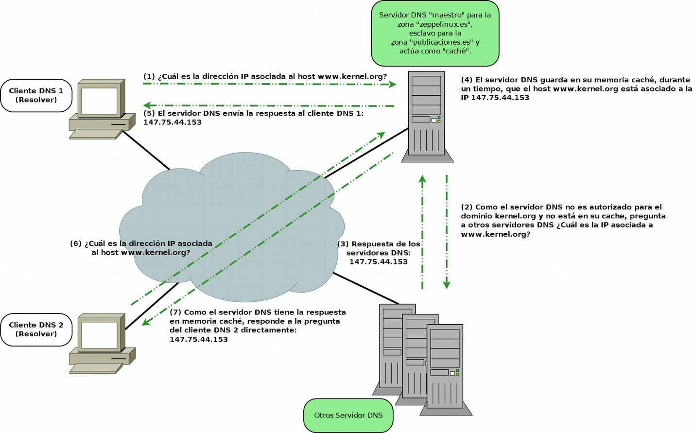


### Servidor forwarder (reenviador)

Cuando a un servidor DNS se le hace una pregunta sobre un nombre de dominio del que no dispone información (no es autorizado), este puede preguntar a otros servidores DNS. Simplificando, existen dos formas de procesar las consultas:

 + El servidor DNS procesa la consulta preguntando a diversos servidores DNS y empezando por los servidores DNS raíz. Consulta iterativa.

    


 + El servidor DNS reenvía la consulta a otro servidor DNS, denominado reenviador (forwarder), para que se encargue de resolverla. Consulta recursiva.
  
    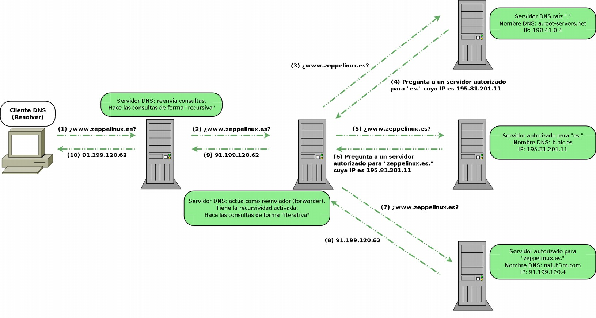

Visto lo anterior, un reenviador (forwarder) es un servidor DNS que otros servidores DNS designan para reenviarle consultas. Son utilizados para minimizar las consultas y el tráfico de peticiones DNS desde una red hacia Internet. Además permiten a los equipos locales utilizar su cache DNs para minimizar los tiempos de respuesta.

### Servidor sólo autorizado

Un Servidor solo autorizado (authoritative only) es aquel que es autorizado para una o varias zonas como servidor maestro y/o esclavo y no responde a preguntas que no sean relativas a sus zonas. Es decir, no tiene activada la recursividad, no es reenviador y no actúa como cache.

### Servidores raíz

En Internet existen un conjunto de servidores DNS autorizados para el dominio raíz `.`, conocidos como servidores raíz (root servers). Contienen el fichero de la zona `.` que contiene información sobre los servidores DNS autorizados para cada uno de los dominios TLD.

Los servidores raíz son una parte fundamental de Internet, son el primer paso en la traducción (resolución) de los nombres de host en direcciones IP, que se utilizan en la comunicación entre los hosts de Internet. Son claves en el proceso de resolución de nombres de dominio en Internet, y deben de ser conocidos por todos los servidores DNS que respondan a preguntas sobre nombres para los que no son autorizados.

Existen 13 servidores raíz en toda Internet y cada uno de ellos tiene múltiples copias distribuidas por todo el mundo, es decir, que físicamente no solo son 13 servidores. Cada conjunto de copias de uno de los 13 servidores se identifica por una misma IP. Cuando un cliente realiza una pregunta a una IP de un servidor raíz, los routers de Internet encaminan la pregunta hacia la copia más cercana mediante un procedimiento denominado *anycasting*.

Los nombres de los servidores raíz son de la forma letra.root-servers.net, donde letra va desde la A a la M.

Listado de Servidores raíz

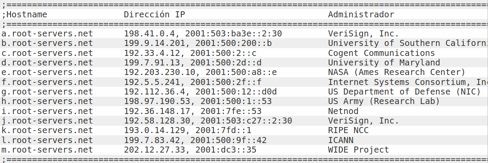

## Tipos de consultas: recursivas e iterativas

### Consultas recursivas

Una consulta recursiva es aquella en la que el servidor DNS da una respuesta completa o exacta. Pueden darse tres tipos de respuesta:

+ Positivas: se devuelve información sobre el dominio consultado
+ Negativas: no se puede resolver el nombre de dominio
+ Error: debido a un fallo en la red

### Consultas iterativas

Una consulta iterativa es aquella en la que el servidor DNS proporciona una respuesta parcial. Existen cuatro posibles respuestas:

  + Positivas: se devuelve información sobre el dominio consultado
  + Negativas: no se puede resolver el nombre de dominio
  + Referencia: el servidor DNS indica a otros servidores a los que se le puede consultar para resolver la pregunta
  + Error: debido a un fallo en la red

### Ejemplos 

Completando la información de la imagen del primer ejemplo del apartado del **reenviador forwarder**:

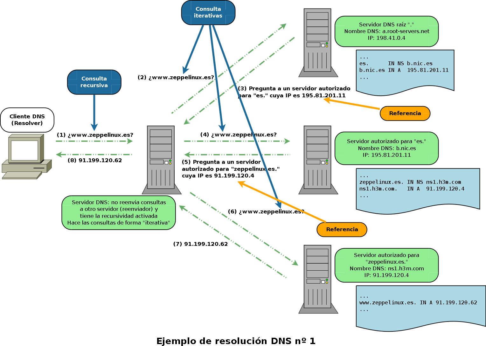

Completando la información de la imagen del segundo ejemplo del apartado del **reenviador forwarder**:


## Resolución inversa

La resolución inversa consiste en obtener información de un nombre de dominio preguntando por la dirección IP en vez de preguntar por el nombre de domino como hemos explicado en apartados anteriores.

### Mapeo de direcciones y el dominio arpa

El funcionamiento de la resolución de direcciones IP es igual al de la resolución de nombrres de dominio. Las direcciones IP se tratan como nombres que cuelgan del dominio `in-addr.arpa` para las direcciones IPv4, y del dominio `ip6.arpa` para las direcciones IPv6.

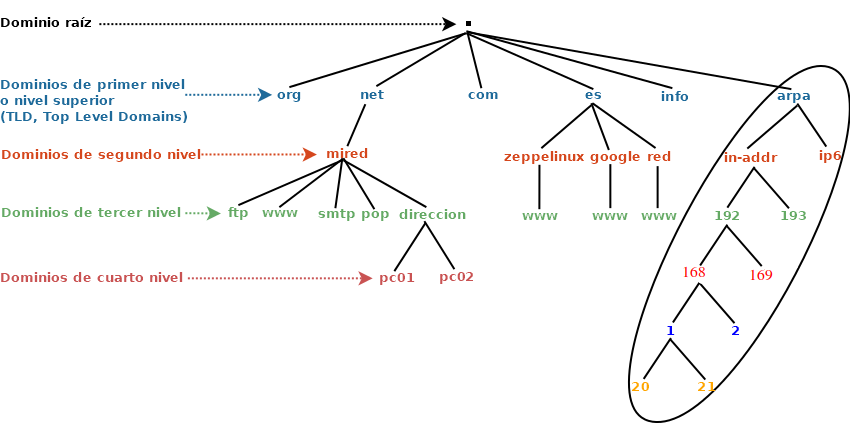

Cuando usamos una dirección IP, por ejemplo `192.168.1.21`, para realizar una pregunta DNS inversa, en realidad estamos preguntando por el nombre de dominio `21.1.168.192.in-addr.arpa`. La estructura jerárquica de la dirección IP, tratada como nombre de dominio, es de derecha a izquierda, comenzando por el dominio `in-addr.arpa`.

`.arpa (Address and Routing Parameter Area)` es un dominio de nivel superior genérico utilizado sólo para la infraestructura de Internet. Los subdominios de .arpa o dominios de segundo nivel «in-addr.arpa» e «ip6.arpa» son usados por los servidores DNS inversos para la obtención de direcciones IPv4 e IPv6 respectivamente.

Cuando mapeamos una dirección IP estamos asociando la dirección IP al nombre en el dominio .arpa. Por ejemplo la dirección `192.168.1.21` es mapeada al nombre `21.1.168.192.in-addr.arpa`.

### Zonas de resolución inversa

Los servidores DNS almacenan zonas de resolución inversa con registros de recursos (RR) que asocien nombres de dominio con direcciones IP. Las zonas de resolución inversa pueden ser maestras o primarias y esclavas o secundarias.

Las zonas de resolución directa e inversa son independientes y es responsabilidad de los administradores de los servidores DNS que dichas zonas contengan información coherente y que no existan discrepancias.

No es obligatorio que la entidad que administra una zona de resolución directa de un dominio tenga que administrar la zona de resolución inversa que se corresponda con las direcciones IPs asociadas a dicho dominio.

```linuxconfig
...
deaw.es.			IN	NS		ns1.deaw.es.
ns1.deaw.es.		IN	A		192.168.1.20
natos.deaw.es.	IN	A		192.168.1.21
waor.deaw.es.		IN	A		192.168.1.22
altea.deaw.es.		IN	A		192.168.1.23
www.deaw.es.		IN	CNAME	natos.deaw.es.
ftp.deaw.es.		IN	CNAME	waor.deaw.es.
...
```

Archivo de zona de resolución directa del dominio deaw.es.

```linuxconfig
...
1.168.192.in-addr.arpa.		IN	NS	ns1.deaw.es.
20.1.168.192.in-addr.arpa.	IN	PTR	ns1.deaw.es.
21.1.168.192.in-addr.arpa.	IN	PTR	natos.deaw.es.
22.1.168.192.in-addr.arpa.	IN	PTR	waor.deaw.es.
123.1.168.192.in-addr.arpa.	IN	PTR	altea.deaw.es.
...
```

Archivo de zona de resolución inversa `1.168.192.in-addr.arpa` que permite resolver consultas inversas sobre direcciones IP de la red `192.168.1.0/24`

### Proceso de resolución

El proceso de resolución inversa es similar al de resolución directa. Las direcciones IP se tratan como nombres de dominio. Por lo tanto, existen consultas recursivas, iterativas, cache, TTL...

Por ejemplo, si un cliente DNS realiza una consulta recursiva de la IP 192.168.1.21 a un servidor DNS, éste, si no lo tiene en cache, iniciará una serie de consultas iterativas a los servidores DNS raíz, a los servidores autorizados para el dominio 192.in-addr.arpa y así sucesivamente. 

## Herramientas

### Nslookup

Es un programa para consultar servidores DNS. Se utiliza para saber si un servidor DNS resuelve correctamente los nombres DNS y las direcciones IP, para solucionar problemas frecuentes de los servidores DNS o, para diagnosticar problemas ocasionales de configuración en los servidores DNS. 

Con nslookup podemos obtener la dirección IP asociada a un nombre DNS y viceversa, además, podemos preguntar a los servidores de nombres información relativa a los registros de recursos (RR) de la/s zona/s de las que son autorizados.

nslookup se usa de dos modos: interactivo y no interactivo. El modo interactivo permite al usuario consultar los servidores DNS para obtener información sobre varios hosts y dominios o para listar los hosts de un dominios. El modo no interactivo se usa para presentar solo el nombre y la información solicitada para un host o nombre DNS.

Este comando funciona tanto en sistemas operativos UNIX/Linux como en Windows.
En su momento se trató a nslookup como una aplicación “deprecated” u obsoleta, pero a día de  hoy parece que ha vuelto a considerarse apta para su uso normal.

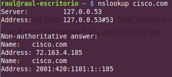

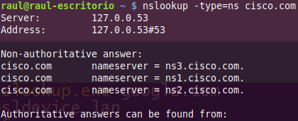

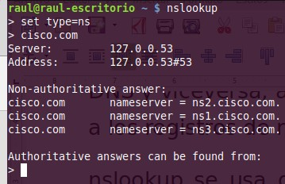

### Dig
Es un programa utilizado para preguntar a los servidores DNS.

Herramienta utilizada para solucionar problemas de DNS gracias a su flexibilidad, facilidad de uso y claridad en la presentación de la información.
Normalmente, dig se usa pasándole argumentos desde la línea de comandos (CLI), pero también tiene un modo de operar por lotes, leyendo las consultas desde un archivo.

Este comando funciona tanto en sistemas operativos UNIX/Linux como en Windows

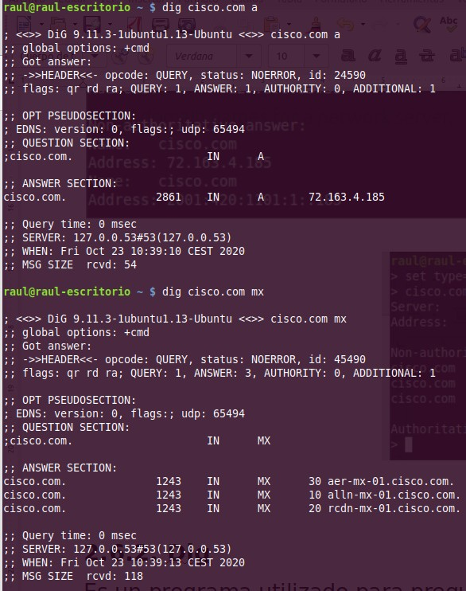

### Host
Host es una herramienta CLI sencilla y fácil de usar para realizar consultas DNS, que traducen nombres de dominio a direcciones IP y viceversa. También se utiliza para consultar los registros DNS de las zonas que almacenan los servidores DNS, probar y validar el servidor DNS y la conectividad a Internet, registros de correo no deseado y listas negras, diagnóstico de problemas en el servidor DNS...

### Whois 
Aunque no es una herramienta de diagnóstico DNS si que nos ofrece información sobre el registro del dominio.

Whois es un protocolo que permite realizar consultas a bases de datos que contienen información; del usuario, empresa u organización que registra un nombre de dominio y/o una dirección IP en Internet. El protocolo whois se encapsula en TCP y solo especifica el intercambio de peticiones y respuestas, no el formato de datos a intercambiar. Por eso, los resultados de las consultas whois pueden variar dependiendo de la base de datos whois a la que se pregunte. 

## Referencias

[</Zeppelinux>](https://www.zeppelinux.es/sistema-de-nombres-de-dominio-dns/)