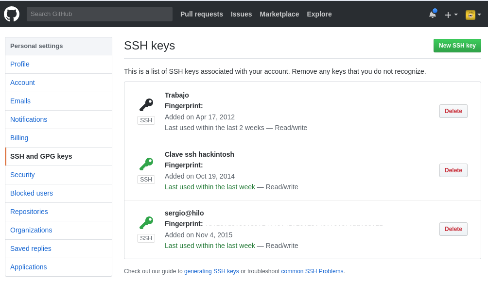
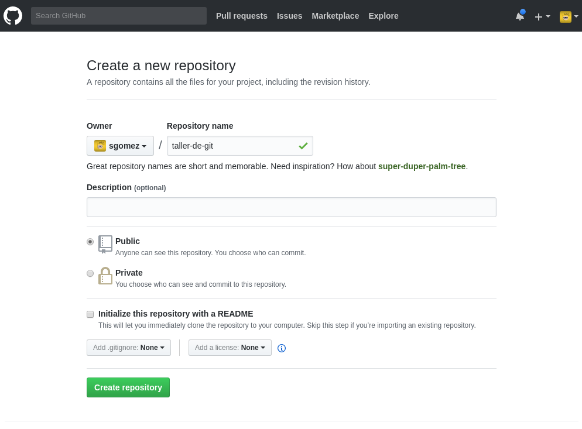
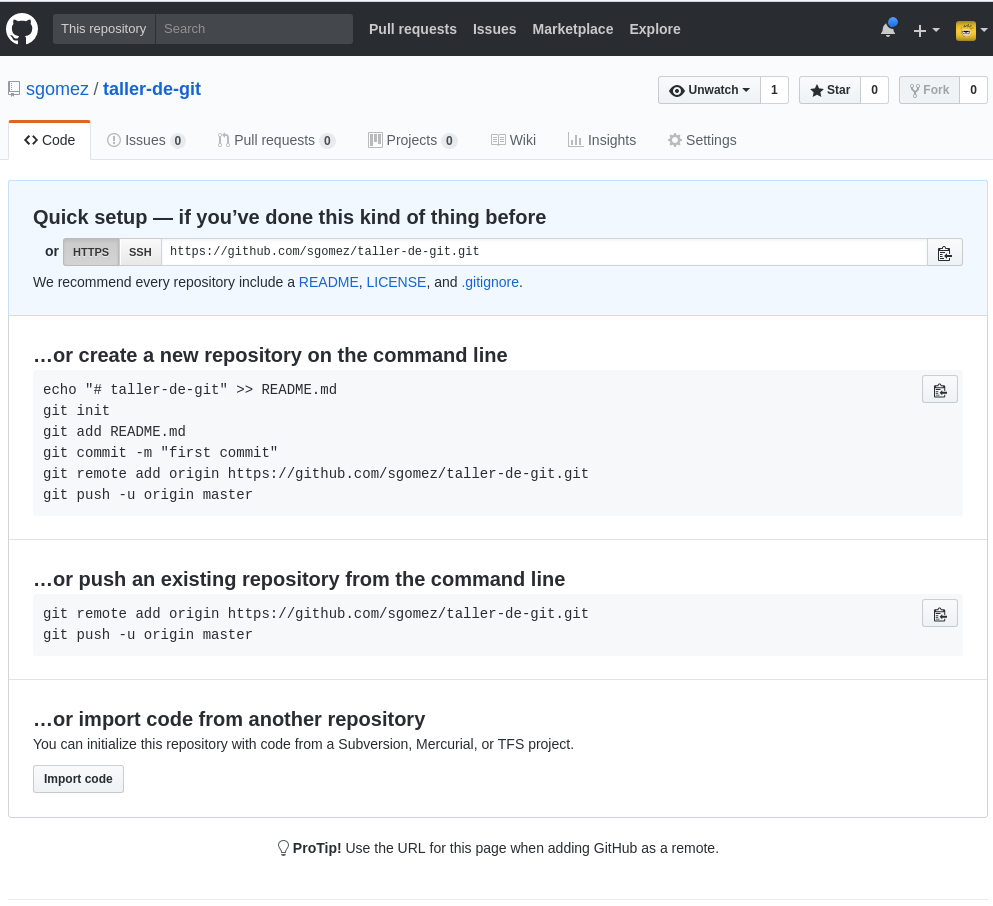
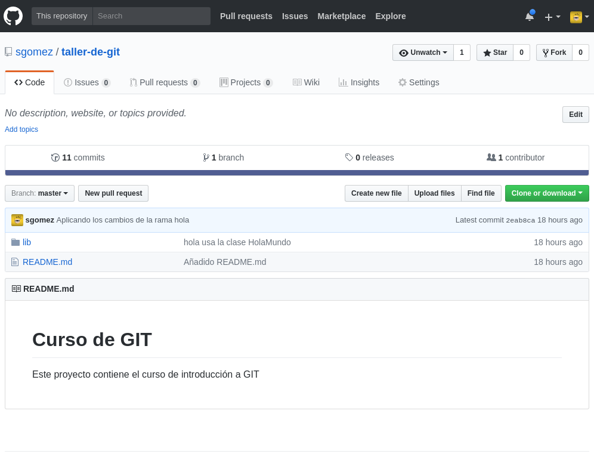
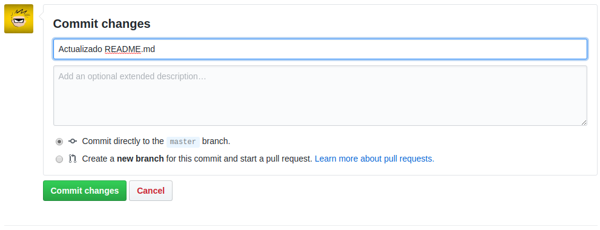

# Github

Github es lo que se denomina una forja, un repositorio de proyectos que usan Git como sistema de control de versiones. Es la forja más popular, ya que alberga más de 10 millones de repositorios. Debe su popularidad a sus funcionalidades sociales, principalmente dos: la posibilidad de hacer forks de otros proyectos y la posibilidad de cooperar aportando código para arreglar errores o mejorar el código. Si bien, no es que fuera una novedad, sí lo es lo fácil que resulta hacerlo. A raíz de este proyecto han surgido otros como _Gitorius_ o _Gitlab_, pero _Github_ sigue siendo el más popular y el que tiene mejores y mayores características. algunas de estas son:

- Un wiki para documentar el proyecto, que usa MarkDown como lenguaje de marca.
- Un portal web para cada proyecto.
- Funcionalidades de redes sociales como followers.
- Gráficos estadísticos.
- Revisión de código y comentarios.
- Sistemas de seguimiento de incidencias.

Lo primero es entrar en el portal ([https://github.com/](https://github.com/)) para crearnos una cuenta si no la tenemos aún.

## Tu clave pública/privada

Muchos servidores Git utilizan la autentificación a través de claves públicas SSH. Y, para ello, cada usuario del sistema ha de generarse una, si es que no la tiene ya. El proceso para hacerlo es similar en casi cualquier sistema operativo. Ante todo, asegurarte que no tengas ya una clave. (comprueba que el directorio `$HOME/usuario/.ssh` no tiene un archivo id_dsa.pub o id_rsa.pub).

Para crear una nueva clave usamos la siguiente orden:

    $ ssh-keygen -t rsa -C "Cuenta Thinstation"

!!! warning

    Tu clave RSA te identifica contra los repositorios remotos, asegúrate de
    no compartir la clave privada con nadie. Por defecto la clave se crea como
    _solo lectura_.

## Configuración

Vamos a aprovechar para añadir la clave RSA que generamos antes, para poder acceder desde git a los repositorios. Para ellos nos vamos al menú de configuración de usuario (_Settings_)


Nos vamos al menú 'SSH and GPG Keys' y añadimos una nueva clave. En _Title_ indicamos una descripción que nos ayude a saber de dónde procede la clave y en key volcamos el contenido del archivo `~/.ssh/id_rsa.pub`. Y guardamos la clave.



Con esto ya tendriamos todo nuestro entorno para poder empezar a trabajar desde nuestro equipo.

## Clientes gráficos para GitHub

Además, para Github existe un cliente propio tanto para Windows como para MacOSX:

- Cliente Windows: [http://windows.github.com/](http://windows.github.com/)

- Cliente MacOSX: [http://mac.github.com/](http://mac.github.com/)

Para Linux no hay cliente propio, pero sí hay plugin para la mayoría de editores de texto como atom, netbeans, eclipe o los editores de jetbrains.

De todas maneras, estos clientes solo tienen el fin de facilitar el uso de Github, pero no son necesarios para usarlo. Es perfectamente válido usar el cliente de consola de Git o cualquier otro cliente genérico para Git. Uno de los más usados actualmente es [GitKraken](https://www.gitkraken.com/).

## Crear un repositorio

Vamos a crear un repositorio donde guardar nuestro proyecto. Para ello pulsamos el signo `+` que hay en la barra superior y seleccionamos `New repository`.

Ahora tenemos que designar un nombre para nuestro repositorio, por ejemplo: '_taller-de-git_'.



Nada más crear el repositorio nos saldrá una pantalla con instrucciones precisas de como proceder a continuación.

Básicamente podemos partir de tres situaciones:

1. Todavía no hemos creado ningún repositorio en nuestro equipo.
1. Ya tenemos un repositorio creado y queremos sincronizarlo con Github.
1. Queremos importar un repositorio de otro sistema de control de versiones distinto.

Veremos una pantalla similar a esta. Los comandos pueden variar ligeramente si existe una nueva versión de git. Fíjate en los comandos que a ti te aparecen.



Nuestra situación es la segunda, así que nos aseguramos de que hemos elegido SSH como protocolo. A continuación pulsamos el icono del portapapeles y ejecutamos las dos ordenes que nos indica la web en nuestro terminal.

    $ git remote add origin git@github.com:sgomez/taller-de-git.git
    $ git branch -M main
    $ git push -u origin main
    Counting objects: 33, done.
    Delta compression using up to 4 threads.
    Compressing objects: 100% (24/24), done.
    Writing objects: 100% (33/33), 3.35 KiB | 1.12 MiB/s, done.
    Total 33 (delta 2), reused 0 (delta 0)
    remote: Resolving deltas: 100% (2/2), done.
    To github.com:sgomez/taller-de-git.git
     * [new branch]      main -> main
    rama 'main' configurada para rastrear 'origin/main'.

!!!Atención
    En la versión de git utilizada al realizar estos apuntes a la rama principal le llama "master". En la versión actual le denomina "main". Cambiaré los comandos y salidas para evitar errores, aunque podrían diferir ligeramente de lo que obtengas.

Si recargamos la página veremos que ya aparece nuestro proyecto.



## Clonar un repositorio

Una vez que ya tengamos sincronizado el repositorio contra Github, eventualmente
vamos a querer descargarlo en otro de nuestros ordenadores para poder trabajar
en él. Esta acción se denomina clonar y para ello usaremos la orden `git clone`.

En la página principal de nuestro proyecto podemos ver un botón que indica `Clone or download`.
Si la pulsamos nos da, de nuevo, la opción de elegir entre clonar con _ssh_ o _https_.
Recordad que si estáis en otro equipo y queréis seguir utilizando ssh deberéis
generar otra para de claves privada/pública como hicimos en la sección de
_[Aspectos básicos de Git](curso-de-git/git/#tu-clave-publicaprivada)_ y instalarla
en nuestro perfil de Github, como vimos anteriormente.

Para clonar nuestro repositorio y poder trabajar con él todo lo que debemos hacer es
lo siguiente:

    $ git clone git@github.com:sgomez/taller-de-git.git
    $ cd taller-de-git

## Ramas remotas

Si ahora vemos el estado de nuestro proyecto veremos algo similar a esto:

```
$ git hist --all
* 2eab8ca 2013-06-16 | Aplicando los cambios de la rama hola (HEAD -> master, origin/main) [Sergio Gomez]
*\
| * 9862f33 2013-06-16 | hola usa la clase HolaMundo (hola) [Sergio Gómez]
| * 6932156 2013-06-16 | Añadida la clase HolaMundo [Sergio Gómez]
|/
* 9c85275 2013-06-16 | Programa interactivo (master) [Sergio Gómez]
* c3e65d0 2013-06-16 | Añadido README.md [Sergio Gómez]
* 81c6e93 2013-06-16 | Movido hola.php a lib [Sergio Gómez]
* 96a39df 2013-06-16 | Añadido el autor del programa y su email [Sergio Gómez]
* fd4da94 2013-06-16 | Se añade un comentario al cambio del valor por defecto (tag: v1) [Sergio Gómez]
* 3283e0d 2013-06-16 | Se añade un parámetro por defecto (tag: v1-beta) [Sergio Gómez]
* efc252e 2013-06-16 | Parametrización del programa [Sergio Gómez]
* e19f2c1 2013-06-16 | Creación del proyecto [Sergio Gómez]
```

Aparece que hay una nueva rama llamada `origin/main`. Esta rama indica el estado de sincronización
de nuestro repositorio con un repositorio remoto llamado _origin_. En este caso el de _Github_.

!!! info

    Por norma se llama automáticamente _origin_ al primer repositorio con el que
    sincronizamos nuestro repositorio.

Podemos ver la configuración de este repositorio remoto con la orden `git remote`:

    $ git remote show origin
    * remote origin
      Fetch URL: git@github.com:sgomez/taller-de-git.git
      Push  URL: git@github.com:sgomez/taller-de-git.git
      HEAD branch: master
      Remote branch:
        main tracked
      Local ref configured for 'git push':
        main pushes to main (up to date)

De la respuesta tenemos que fijarnos en las líneas que indican _fetch_ y _push_
puesto que son las acciones de sincronización de nuestro repositorio con el remoto.
Mientras que _fetch_ se encarga de traer los cambios desde el repositorio remoto
al nuestro, _push_ los envía.

## Enviando actualizaciones

Vamos a añadir una licencia a nuestra aplicación. Creamos un fichero LICENSE con el siguiente contenido:

```
MIT License

Copyright (c) [year] [fullname]

Permission is hereby granted, free of charge, to any person obtaining a copy
of this software and associated documentation files (the "Software"), to deal
in the Software without restriction, including without limitation the rights
to use, copy, modify, merge, publish, distribute, sublicense, and/or sell
copies of the Software, and to permit persons to whom the Software is
furnished to do so, subject to the following conditions:

The above copyright notice and this permission notice shall be included in all
copies or substantial portions of the Software.

THE SOFTWARE IS PROVIDED "AS IS", WITHOUT WARRANTY OF ANY KIND, EXPRESS OR
IMPLIED, INCLUDING BUT NOT LIMITED TO THE WARRANTIES OF MERCHANTABILITY,
FITNESS FOR A PARTICULAR PURPOSE AND NONINFRINGEMENT. IN NO EVENT SHALL THE
AUTHORS OR COPYRIGHT HOLDERS BE LIABLE FOR ANY CLAIM, DAMAGES OR OTHER
LIABILITY, WHETHER IN AN ACTION OF CONTRACT, TORT OR OTHERWISE, ARISING FROM,
OUT OF OR IN CONNECTION WITH THE SOFTWARE OR THE USE OR OTHER DEALINGS IN THE
SOFTWARE.
```

Y añadidos y confirmamos los cambios:

```
$ git add LICENSE
$ git commit -m "Añadida licencia"
[master 3f5cb1c] Añadida licencia
 1 file changed, 21 insertions(+)
 create mode 100644 LICENSE
$ git hist --all
* 3f5cb1c 2013-06-16 | Añadida licencia (HEAD -> main) [Sergio Gómez]
* 2eab8ca 2013-06-16 | Aplicando los cambios de la rama hola (origin/main) [Sergio Gomez]
*\
| * 9862f33 2013-06-16 | hola usa la clase HolaMundo (hola) [Sergio Gómez]
| * 6932156 2013-06-16 | Añadida la clase HolaMundo [Sergio Gómez]
|/
* 9c85275 2013-06-16 | Programa interactivo (master) [Sergio Gómez]
* c3e65d0 2013-06-16 | Añadido README.md [Sergio Gómez]
* 81c6e93 2013-06-16 | Movido hola.php a lib [Sergio Gómez]
* 96a39df 2013-06-16 | Añadido el autor del programa y su email [Sergio Gómez]
* fd4da94 2013-06-16 | Se añade un comentario al cambio del valor por defecto (tag: v1) [Sergio Gómez]
* 3283e0d 2013-06-16 | Se añade un parámetro por defecto (tag: v1-beta) [Sergio Gómez]
* efc252e 2013-06-16 | Parametrización del programa [Sergio Gómez]
* e19f2c1 2013-06-16 | Creación del proyecto [Sergio Gómez]
```

Viendo la historia podemos ver como nuestro master no está en el mismo punto que
`origin/main`. Si vamos a la web de _Github_ veremos que `LICENSE` no aparece aún.
Así que vamos a enviar los cambios con la primera de las acciones que vimos `git push`:

    $ git push
    Counting objects: 3, done.
    Delta compression using up to 4 threads.
    Compressing objects: 100% (3/3), done.
    Writing objects: 100% (3/3), 941 bytes | 0 bytes/s, done.
    Total 3 (delta 0), reused 0 (delta 0)
    To git@github.com:sgomez/taller-de-git.git
       2eab8ca..3f5cb1c  main -> main
    Branch master set up to track remote branch main from origin.

!!! info

    La orden `git push` necesita dos parámetros para funcionar: el repositorio
    y la rama destino. Así que realmente lo que teníamos que haber escrito es:

        $ git push origin main

    Para ahorrar tiempo escribiendo _git_ nos deja vincular nuestra rama local
    con una rama remota, de tal manera que no tengamos que estar siempre indicándolo.
    Eso es posible con el parámetro `--set-upstream` o `-u` en forma abreviada.

        $ git push -u origin main

    Si repasas las órdenes que te indicó Github que ejecutaras verás que el parámetro
    `-u` estaba presente y por eso no ha sido necesario indicar ningún parámetro
    al hacer push.

## Recibiendo actualizaciones

Si trabajamos con más personas, o trabajamos desde dos ordenadores distintos, nos encontraremos
con que nuestro repositorio local es más antiguo que el remoto. Necesitamos descargar
los cambios para poder incorporarlos a nuestro directorio de trabajo.

Para la prueba, Github nos permite editar archivos directamente desde la web. Pulsamos sobre
el archivo `README.md`. En la vista del archivo, veremos que aparece el icono de un lápiz.
Esto nos permite editar el archivo.


!!! info

    Los archivos con extensión `.md` están en un formato denominado _MarkDown_. Se trata
    de un lenguaje de marca que nos permite escribir texto enriquecido de manera muy sencilla.

    Dispones de un tutorial aquí: [https://www.markdowntutorial.com/](https://www.markdowntutorial.com/)

Modificamos el archivo como queramos, por ejemplo, añadiendo nuestro nombre:

```
# Curso de GIT

Este proyecto contiene el curso de introducción a GIT

Desarrollado por Sergio Gómez.
```



El cambio quedará incorporado al repositorio de Github, pero no al nuestro. Necesitamos
traer la información desde el servidor remoto. La orden asociada es `git fetch`:

```
$ git fetch
$ git hist --all
* cbaf831 2013-06-16 | Actualizado README.md (origin/main) [Sergio Gómez]
* 3f5cb1c 2013-06-16 | Añadida licencia (HEAD -> mainq) [Sergio Gómez]
* 2eab8ca 2013-06-16 | Aplicando los cambios de la rama hola [Sergio Gomez]
*\
| * 9862f33 2013-06-16 | hola usa la clase HolaMundo (hola) [Sergio Gómez]
| * 6932156 2013-06-16 | Añadida la clase HolaMundo [Sergio Gómez]
|/
* 9c85275 2013-06-16 | Programa interactivo (master) [Sergio Gómez]
* c3e65d0 2013-06-16 | Añadido README.md [Sergio Gómez]
* 81c6e93 2013-06-16 | Movido hola.php a lib [Sergio Gómez]
* 96a39df 2013-06-16 | Añadido el autor del programa y su email [Sergio Gómez]
* fd4da94 2013-06-16 | Se añade un comentario al cambio del valor por defecto (tag: v1) [Sergio Gómez]
* 3283e0d 2013-06-16 | Se añade un parámetro por defecto (tag: v1-beta) [Sergio Gómez]
* efc252e 2013-06-16 | Parametrización del programa [Sergio Gómez]
* e19f2c1 2013-06-16 | Creación del proyecto [Sergio Gómez]
```

Ahora vemos el caso contrario, tenemos que `origin/master` está por delante que `HEAD` y
que la rama `master` local.

Ahora necesitamos incorporar los cambios de la rama remota en la local. La forma de hacerlo
lo vimos en el [capítulo anterior](Ud6_07_ramas.md/#mezclar-ramas) usando `git merge` o `git rebase`.

Habitualmente se usa `git merge`:

```
$ git merge origin/main
Updating 3f5cb1c..cbaf831
Fast-forward
 README.md | 2 ++
 1 file changed, 2 insertions(+)
$ git hist --all
* cbaf831 2013-06-16 | Actualizado README.md (HEAD -> main, origin/main) [Sergio Gómez]
* 3f5cb1c 2013-06-16 | Añadida licencia [Sergio Gómez]
* 2eab8ca 2013-06-16 | Aplicando los cambios de la rama hola [Sergio Gomez]
*\
| * 9862f33 2013-06-16 | hola usa la clase HolaMundo (hola) [Sergio Gómez]
| * 6932156 2013-06-16 | Añadida la clase HolaMundo [Sergio Gómez]
|/
* 9c85275 2013-06-16 | Programa interactivo (master) [Sergio Gómez]
* c3e65d0 2013-06-16 | Añadido README.md [Sergio Gómez]
* 81c6e93 2013-06-16 | Movido hola.php a lib [Sergio Gómez]
* 96a39df 2013-06-16 | Añadido el autor del programa y su email [Sergio Gómez]
* fd4da94 2013-06-16 | Se añade un comentario al cambio del valor por defecto (tag: v1) [Sergio Gómez]
* 3283e0d 2013-06-16 | Se añade un parámetro por defecto (tag: v1-beta) [Sergio Gómez]
* efc252e 2013-06-16 | Parametrización del programa [Sergio Gómez]
* e19f2c1 2013-06-16 | Creación del proyecto [Sergio Gómez]
```

Como las operaciones de traer cambios (`git fetch`) y de mezclar ramas (`git merge` o `git rebase`)
están muy asociadas, _git_ nos ofrece una posibilidad para ahorrar pasos que es la orden `git pull`
que realiza las dos acciones simultáneamente.

Para probar, vamos a editar de nuevo el archivo README.md y añadimos algo más:

```
# Curso de GIT

Este proyecto contiene el curso de introducción a GIT del Aula de Software Libre.

Desarrollado por Sergio Gómez.
```

Como mensaje del _commit_: _'Indicado que se realiza en el ASL'_.

Y ahora probamos a actualizar con `git pull`:

```
$ git pull
remote: Counting objects: 3, done.
remote: Compressing objects: 100% (3/3), done.
remote: Total 3 (delta 0), reused 0 (delta 0), pack-reused 0
Unpacking objects: 100% (3/3), done.
From github.com:sgomez/taller-de-git
   cbaf831..d8922e4  master     -> origin/master
First, rewinding head to replay your work on top of it...
Fast-forwarded master to d8922e4ffa4f87553b03e77df6196b7e496bfec4.
$ git hist --all
* d8922e4 2013-06-16 | Indicado que se realiza en el ASL (HEAD -> main, origin/main) [Sergio Gómez]
* cbaf831 2013-06-16 | Actualizado README.md [Sergio Gómez]
* 3f5cb1c 2013-06-16 | Añadida licencia [Sergio Gómez]
* 2eab8ca 2013-06-16 | Aplicando los cambios de la rama hola [Sergio Gomez]
*\
| * 9862f33 2013-06-16 | hola usa la clase HolaMundo (hola) [Sergio Gómez]
| * 6932156 2013-06-16 | Añadida la clase HolaMundo [Sergio Gómez]
|/
* 9c85275 2013-06-16 | Programa interactivo (master) [Sergio Gómez]
* c3e65d0 2013-06-16 | Añadido README.md [Sergio Gómez]
* 81c6e93 2013-06-16 | Movido hola.php a lib [Sergio Gómez]
* 96a39df 2013-06-16 | Añadido el autor del programa y su email [Sergio Gómez]
* fd4da94 2013-06-16 | Se añade un comentario al cambio del valor por defecto (tag: v1) [Sergio Gómez]
* 3283e0d 2013-06-16 | Se añade un parámetro por defecto (tag: v1-beta) [Sergio Gómez]
* efc252e 2013-06-16 | Parametrización del programa [Sergio Gómez]
* e19f2c1 2013-06-16 | Creación del proyecto [Sergio Gómez]
```

Vemos que los cambios se han incorporado y que las ramas remota y local de _master_ están
sincronizadas.

## Problemas de sincronización

### No puedo hacer push

Al intentar subir cambios nos podemos encontrar un mensaje como este:

```
$ git push
git push
To git@github.com:sgomez/taller-de-git.git
 ! [rejected]        master -> master (fetch first)
error: failed to push some refs to 'git@github.com:sgomez/taller-de-git.git'
hint: Updates were rejected because the remote contains work that you do
hint: not have locally. This is usually caused by another repository pushing
hint: to the same ref. You may want to first integrate the remote changes
hint: (e.g., 'git pull ...') before pushing again.
hint: See the 'Note about fast-forwards' in 'git push --help' for details.
```

La causa es que el repositorio remoto también se ha actualizado y nosotros aún
no hemos recibido esos cambios. Es decir, ambos repositorios se han actualizado
y el remoto tiene preferencia. Hay un conflicto en ciernes y se debe resolver
localmente antes de continuar.

Vamos a provocar una situación donde podamos ver esto en acción. Vamos a modificar el
archivo `README.md` tanto en local como en remoto a través del interfaz web.

En el web vamos a cambiar el título para que aparezca de la siguiente manera.

    Curso de GIT, 2020

En local vamos a cambiar el título para que aparezca de la siguiente manera.

    Curso de GIT, febrero

!!! question

    Haz el commit para guardar el cambio en local.

??? example "Respuesta al ejercicio anterior"

    Añadimos el fichero actualizado:

        $ git commit -am "Añadido el mes al README"
        [master 1e8c0b7] Añadido el mes al README
        1 file changed, 1 insertion(+), 1 deletion(-)

La forma de proceder en este caso es hacer un `git fetch` y un `git rebase`. Si
hay conflictos deberán resolverse. Cuando esté todo solucionado ya podremos hacer
`git push`.

!!! info

    Por defecto `git pull` lo que hace es un `git merge`, si queremos hacer
    `git rebase` deberemos especificarlos con el parámetro `-r`:

        $ git pull --rebase

Vamos a hacer el pull con rebase y ver qué sucede.

    $ git pull --rebase
    First, rewinding head to replay your work on top of it...
    Applying: Añadido el mes al README
    Using index info to reconstruct a base tree...
    M	README.md
    Falling back to patching base and 3-way merge...
    Auto-merging README.md
    CONFLICT (content): Merge conflict in README.md
    error: Failed to merge in the changes.
    Patch failed at 0001 Añadido el mes al README
    hint: Use 'git am --show-current-patch' to see the failed patch

    Resolve all conflicts manually, mark them as resolved with
    "git add/rm <conflicted_files>", then run "git rebase --continue".
    You can instead skip this commit: run "git rebase --skip".
    To abort and get back to the state before "git rebase", run "git rebase --abort".

Evidentemente hay un conflicto porque hemos tocado el mismo archivo. Se deja como ejercicio resolverlo.

??? example "Respuesta al ejercicio anterior"

    El contenido del fichero final podría ser:

        Curso de GIT, febrero, 2020

    A continuación confirmamos los cambios y los enviamos al servidor

        $ git add README.md
        $ git rebase --continue
        $ git push

!!! warning

    ¿Por qué hemos hecho rebase en master si a lo largo del curso hemos dicho que no se debe cambiar
    la linea principal?

    Básicamente hemos dicho que lo que no debemos hacer es modificar la línea temporal **compartida**.
    En este caso nuestros cambios en _master_ solo estaban en nuestro repositorio, porque al fallar
    el envío nadie más ha visto nuestras actualizaciones. Al hacer _rebase_ estamos deshaciendo nuestros
    cambios, bajarnos la última actualización compartida de _master_ y volviéndolos a aplicar. Con lo que
    realmente la historia compartida no se ha modificado.

Este es un problema que debemos evitar en la medida de lo posible. La menor cantidad
de gente posible debe tener acceso de escritura en master y las actualizaciones de dicha rama deben
hacerse a través de ramas secundarias y haciendo merge en master como hemos visto en el capítulo de ramas.

### No puedo hacer pull

Al intentar descargar cambios nos podemos encontrar un mensaje como este:

    $ git pull
    error: Cannot pull with rebase: You have unstaged changes.

O como este:

    $ git pull
    error: Cannot pull with rebase: Your index contains uncommitted changes.

Básicamente lo que ocurre es que tenemos cambios sin confirmar en nuestro espacio
de trabajo. Una opción es confirmar (_commit_) y entonces proceder como el caso anterior.

Pero puede ocurrir que aún estemos trabajando todavía y no nos interese confirmar
los cambios, solo queremos sincronizar y seguir trabajando. Para casos como estos
_git_ ofrece una pila para guardar cambios temporalmente. Esta pila se llama _stash_
y nos permite restaurar el espacio de trabajo al último commit.

De nuevo vamos a modificar nuestro proyecto para ver esta situación en acción.

!!! example

    En remoto borra el año de la fecha y en local borra el mes. Pero esta vez
    **no hagas commit en local**. El archivo solo debe quedar modificado.

La forma de proceder es la siguiente:

```
$ git stash save # Guardamos los cambios en la pila
$ git pull # Sincronizamos con el repositorio remoto, -r para hacer rebase puede ser requerido
$ git stash pop # Sacamos los cambios de la pila
```

!!! info

    Como ocurre habitualmente, git nos proporciona una forma de hacer todos estos pasos de una
    sola vez. Para ello tenemos que ejecutar lo siguiente:

        $ git pull --autostash

    En general no es mala idea ejecutar lo siguiente si somos conscientes, además, de que tenemos varios
    cambios sin sincronizar:

        $ git pull --autostash --rebase

Podría darse el caso de que al sacar los cambios de la pila hubiera algún
conflicto. En ese caso actuamos como con el caso de _merge_ o _rebase_.

De nuevo este tipo de problemas no deben suceder si nos acostumbramos a trabajar en ramas.
