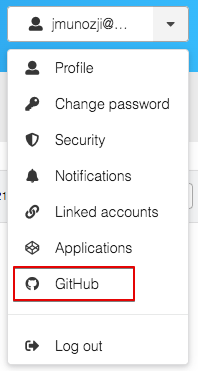

# Citar proyectos en GitHub

Extraído de la [guía oficial de GitHub](https://guides.github.com/activities/citable-code/).

A través de una aplicación de terceros (Zenodo, financiado por el CERN), es posible crear un DOI para uno de nuestros proyectos.

!!!Nota
    
    DOI significa "Digital Object Identifier" (Identificador de Objeto Digital, en español). Es un sistema único y permanente de identificación alfanumérica que se utiliza para identificar de manera única y unívoca documentos digitales. Los DOI se utilizan comúnmente para identificar y enlazar de manera única a documentos académicos, como artículos de investigación, informes técnicos, conjuntos de datos y otros tipos de contenidos digitales.

    Un DOI proporciona un enlace persistente a un objeto digital, lo que significa que el enlace debería seguir siendo válido a lo largo del tiempo, incluso si la ubicación física o la URL del objeto cambia. Esto es especialmente útil en el ámbito académico y de la investigación, donde la referencia y la citación de trabajos anteriores son fundamentales.

    Los DOI son gestionados por organizaciones llamadas "Registradores de DOI", que asignan y mantienen estos identificadores. Cada DOI consta de un prefijo que identifica al registrador y un sufijo único que identifica específicamente el objeto digital.

    Cuando se encuentra un DOI, se puede utilizar para acceder rápidamente al documento al que hace referencia, ya que se trata de un identificador único y permanente.

Estos son los pasos

## Paso 1. Elegir un repositorio

Este repositorio debe ser abierto (público), o de lo contrario Zenodo no podrá acceder al mismo. Hay que recordar escoger una licencia para el proyecto. Esta web puede ayudarnos [http://choosealicense.com/](http://choosealicense.com/).

## Paso 2. Entrar en Zenodo

Iremos a [Zenodo](http://zenodo.org/) y haremos login con GitHub. Lo único que tenemos que hacer en esta parte es autorizar a Zenodo a conectar con nuestra cuenta de GitHub.

!!! important

    Si deseas archivar un repositorio que pertenece a una organización en GitHub, deberás asegurarte de que el administrador de la organización haya habilitado el acceso de terceros a la aplicación Zenodo.

## Paso 3. Seleccionar los repositorios

En este punto, hemos autorizado a Zenodo para configurar los permisos necesarios para permitir el archivado y la emisión del DOI. 

En primer lugar ve al desplegable, arriba a la derecha, despliega y selecciona GitHub.

Para habilitar esta funcionalidad, simplemente haremo clic en el botón que está junto a cada uno de los repositorios que queremos archivar.

!!! important

    Zenodo solo puede acceder a los repositorios públicos, así que debemos asegurarnos de que el repositorio que deseamos archivar sea público.

## Paso 4. Crear una nueva _release_

Por defecto, Zenodo realiza un archivo de nuestro repositorio de GitHub cada vez que crea una nueva versión. 

!!!nota
    En GitHub, un "release" (lanzamiento) se refiere a una versión específica de un proyecto de software que se considera estable y lista para ser distribuida. Un release generalmente está asociado con un conjunto de cambios, nuevas características, correcciones de errores y mejoras en el código fuente del proyecto.

    Cuando un proyecto alcanza un punto en el que los desarrolladores consideran que ha alcanzado una cierta estabilidad y desean compartir una versión específica con los usuarios o colaboradores, pueden crear un release. Los releases en GitHub proporcionan una forma estructurada de empaquetar y distribuir versiones específicas de un proyecto.

    Un release suele estar vinculado a una etiqueta específica en el repositorio de Git. Esta etiqueta marca un punto específico en la historia del código fuente que se corresponde con la versión del release.

Como aún no tenemos ninguna, tenemos que volver a la vista del repositorio principal y hacer clic en el elemento del encabezado de versiones (_releases_).

## Paso 5. Acuñar un DOI

Antes de que Zenodo pueda emitir un DOI para nuestro repositorio, deberemos proporcionar cierta información sobre el repositorio de GitHub que acaba de archivar.

Una vez que estemos satisfechos con la descripción, heremos clic en el botón publicar.

## Paso 6. Publicar

De vuelta a nuestra página de Zenodo, ahora deberíamos ver el repositorio listado con una nueva insignia que muestra nuestro nuevo DOI.

!!! tip

    Podemos colocar la insigna en nuestro proyecto. Para eso haremos clic en la imagen DOI gris y azul. Se abrirá una ventana emergente y el texto que aparece como _Markdown_ es el que deberemos copiar
    en nuestro archivo _README.md_.
